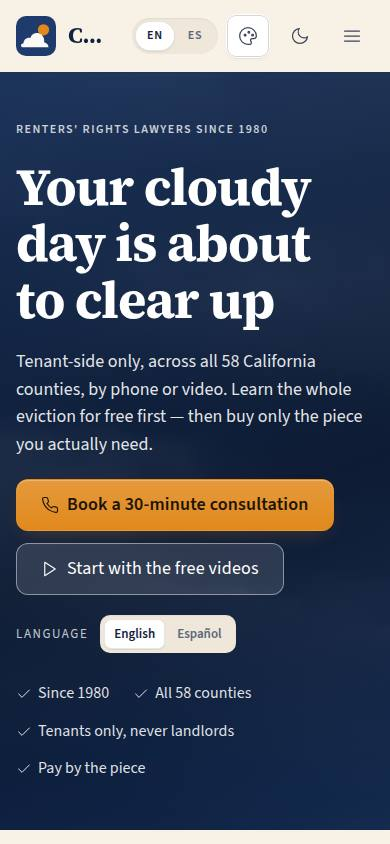
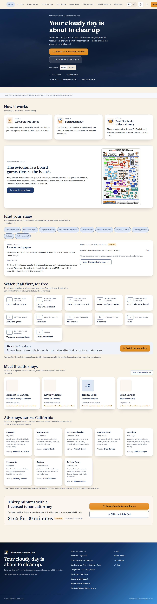

# P-01 · Public home

## Purpose

The concept for the redesigned caltenantlaw.com. A renter arrives frightened, with a notice in their hand, and the page has one job: get them educated before it asks for money. It leads with the firm's own promise ("Your cloudy day is about to clear up") under the brand line "Renters' rights lawyers since 1980", explains the three-step funnel (free videos → intake → a paid 30-minute attorney consultation), teases the Unlawful Detainer Game Board, lets the visitor find their own stage of the eviction and see the services listed for it, previews the video curriculum, shows the network of regional offices, and ends on the booking band. English and Spanish are switchable from the header and from the hero.

## Screenshots

| 390 | 1280 |
| --- | --- |
|  |  |

Dark: `../screenshots/P-01/390-dark.jpg`, `../screenshots/P-01/1280-dark.jpg`. TV: `../screenshots/P-01/3840.jpg`, `../screenshots/P-01/3840-dark.jpg`.

## Sections (layout order)

1. **SiteLayout** — sticky header (brand, nav, language, theme, consultation CTA), footer with the regional offices from `tenants`.
2. **Hero** — brand eyebrow, the promise, the lead, the two calls to action, the EN/ES control, a four-item trust strip.
3. **Demo notice** — says plainly that this is a concept and nothing takes a payment yet.
4. **How it works** — three cards: watch the free videos, fill in the intake, book 30 minutes with an attorney.
5. **Game board teaser** — what the board is, plus a link to `/#/board`.
6. **Find your stage** — ten chips for the ten board stages; the selected stage renders "where you are", "what we do" and the services indexed under it.
7. **Video curriculum** — twelve lessons from the firm's series; every play control now opens the real library (P-06), and a strip under them links to all 36 free videos.
8. **Meet the attorneys** — four PersonCards (portrait or initials, name, title, office · city, unverified badge) and a link to the team page (P-05).
9. **Offices** — one card per regional office from the `tenants` table, each naming its attorney with a link to P-05 filtered to that office.
10. **Booking band** — the consultation offer, its listed price behind an "unverified" badge, and the two primary actions.

## Data

| Table | Read / write | Notes |
| --- | --- | --- |
| `tenants` | read | `kind = office`, ordered by `sort_order`; the offices strip and the SiteLayout footer. The eight real offices as posted on caltenantlaw.com (D-044). |
| `attorneys` | read | Ordered by `order_index`; the first four fill the "meet the attorneys" strip and each office card names its own attorney. Every row is badged unverified (D-046). |
| `lessons` | read | `kind = video`, for the count in the "watch the free videos" strip (the full library is P-06). |

Static content (stages, SKU lists, lessons, steps) lives in `src/modules/site/siteData.ts` until the store catalog (P-10) and the learning module (C-40) own it in Pass 2.

## Rules

- `RULE-INTAKE-01` — the consultation is presented as a prepaid, time-boxed 30 minutes with a licensed attorney, never as free advice.
- `RULE-NOTICE-01` — the notice stage names the 3-day and 30 / 60 / 90-day notice families without asserting an unverified period as the reader's deadline.
- `RULE-UD-01` — the "served" stage says the response window is in court days and that the ten-court-day figure on the current site is verified before it drives a deadline.

## Actions (manifest)

| Id | Intent | Permission | Params | Live |
| --- | --- | --- | --- | --- |
| `site.pickStage` | show what happens at a stage of the eviction | none | `stage: enum` | yes |
| `site.openStore` | see the documents and services for this stage | `store.read` | `stage: enum` | stub (P-10, Pass 2) |
| `site.startIntake` | fill in the consultation intake form | none | — | stub (F-10, Pass 2) |
| `site.bookConsult` | book a 30-minute attorney consultation | none | — | stub (F-11, Pass 2) |
| `site.watchVideo` | watch one of the free videos | none | `lessonId: string` | yes (opens P-06) |
| `site.openAttorneys` | see the attorneys and which office they work from | none | — | yes |
| `site.openVideos` | open the free video library | none | — | yes |
| `site.openBoard` | open the eviction game board | none | — | yes |
| `site.setLang` | read the site in English or Spanish | none | `lang: enum:en,es` | yes |

## Logic

- The stage picker is single-select and opens on "I was served papers" (the most common entry point); clicking the selected chip clears it. The selection becomes a URL parameter when the store lands.
- Stage-picker prices are read live from the `services` table (the catalog scraped from caltenantlaw.com on 2026-09-18, D-040), behind an "Unverified" badge and the note "Prices and services as listed on caltenantlaw.com on 2026-09-18; not yet confirmed by the firm."; the hero poster, the Game Board poster and the three how-it-works tiles are the firm's own artwork from the `illustrations` table (D-042).
- Offices come from the provider, not from a hard-coded list, so the real network replaces the demo rows without a code change.
- The attorneys strip and the office cards read the `attorneys` table; portraits resolve base-relative (`import.meta.env.BASE_URL` + `brand/people/<slug>.png`) so they load under the GitHub Pages sub-path, and an attorney with no published photo shows initials. Every portrait carries the same "as shown on caltenantlaw.com · unverified" badge as P-05 (D-046).
- Each office card links to `/site/attorneys?office=<office slug>`, so "who covers Sacramento" is one click and one addressable URL.

## Components

SiteLayout, Section, Card, Button, Chip, Badge, Icon, SegmentedControl, Placeholder, Tooltip, PersonCard, Avatar.

## Placeholders

| Control | Planned in |
| --- | --- |
| Book a 30-minute consultation (hero and booking band) | intake F-10 and scheduling F-11, Pass 2 |
| Fill in the intake first | intake F-10 and scheduling F-11, Pass 2 |
| Open this stage in the store | store P-10, Pass 2 |

The lesson cards' "play" placeholder is gone: the control opens the real video library (P-06).

## Real vs mock

Real: the eight offices, cities and coverage (from the `tenants` table, seeded from `docs/data/offices.json`, D-044), the eight attorneys and their portraits (from the `attorneys` table, badged unverified, D-046), the video count and the library behind it (P-06), the stage-picker prices (from `services`), the firm's artwork (from `illustrations`), the language switch, the link to the game board. Mock: the hand-written stage copy in `siteData.ts`, the sample video cards (the real library is C-03), the intake and booking buttons (Placeholders, Pass 2).

## Inputs and responsive check (P-01, P-03)

Checked at 360, 390, 768, 1280, 1920, 2560 and 3840 in light and dark: 56 cells, 0 failing, 0 a11y findings. Stage chips, play buttons and the CTAs are all keyboard reachable with a visible focus ring; the placeholder tooltips open on focus as well as hover, so nothing is hover-only. Targets are at least 44 px. At 2560 and 3840 the `--scale` band lifts type and spacing, and the hero headline steps up again at 1920 so the page reads from across a room. Card grids use `auto-fit` with a `min(100%, …)` floor, so nothing overflows at 360.

## Changelog

- `docs/changelog/0005-site-and-proposal.md`
- `docs/changelog/0025-site-people.md` (0.2.0-dev: attorneys strip, video library strip, attorney per office, play opens P-06)

## Resumen en español

La página principal del sitio público rediseñado: el embudo que educa primero (videos gratis, formulario de admisión, consulta pagada de 30 minutos), el tablero del desalojo, un selector de etapa que lleva a los servicios de esa etapa, el currículo de videos y la red de oficinas. Todos los precios aparecen marcados como "sin verificar" y "según el sitio actual".
