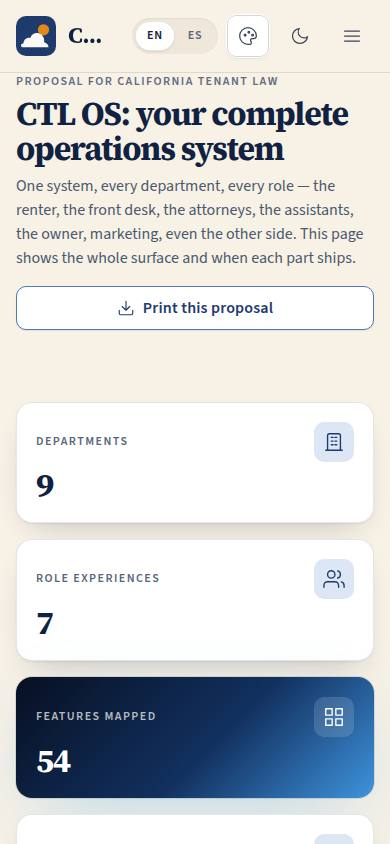
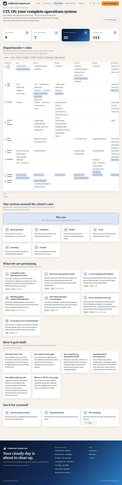

# P-02 · Proposal: the full-stack view

## Purpose

The proposal page for the firm's decision makers. It has to show that the whole operation has been thought through, not asserted. The centrepiece is an interactive matrix of nine departments against seven role experiences: every cell is a feature a specific person uses in a specific part of the firm, and selecting one opens a drawer saying what it does, which pass ships it and which pages build it. Around the matrix: the case at the centre of the system, the seven promises that change the firm's day, the method the system is being built with, and links into the live project board and the game board.

## Screenshots

| 390 | 1280 |
| --- | --- |
|  |  |

Dark: `../screenshots/P-02/390-dark.jpg`, `../screenshots/P-02/1280-dark.jpg`. TV: `../screenshots/P-02/3840.jpg`.

## Sections (layout order)

1. **PageHeader** — eyebrow, title, lead, print action.
2. **Stat tiles** — departments, role experiences, features mapped, planned tasks (counted, never typed).
3. **Departments × roles** — the matrix, with a role filter and feature chips per cell.
4. **Feature drawer** — what it does, who uses it, when it ships, page codes, the planned tasks behind it.
5. **One system around the client's case** — the case at the centre with board position, deadlines, binder, costs, learning and comms around it.
6. **What we are promising** — seven promise cards, each carrying its status, pass and page codes.
7. **How it gets built** — hub, dev mode, annotations, docs in the same turn, model routing, the quality bar.
8. **See it for yourself** — the project board, the game board, the roadmap.

## Data

| Table | Read / write | Notes |
| --- | --- | --- |
| `tenants` | read | via SiteLayout (header and footer offices). |

`docs/plan/tasks.json` is imported at build time for pass, status and task titles, so the proposal cannot disagree with the plan (D-014).

## Rules

- `RULE-SYS-01` — every page is specified, checked and documented; the method section is the public face of this rule.
- `RULE-SYS-02` — data goes through the provider with tenant, id, updated_at and version; the "one system around the case" section states it in the firm's language.
- `RULE-SYS-03` — annotations are triaged before anything changes; the method section says so and P-04 explains it.

## Actions (manifest)

| Id | Intent | Permission | Params | Live |
| --- | --- | --- | --- | --- |
| `site.filterRole` | show only what one role does | none | `role: enum` | yes |
| `site.resetMatrix` | show every role column again | none | — | yes |
| `site.openFeature` | explain one feature and say when it ships | none | `featureId: string` | yes |
| `site.openPlan` | open the live project plan | `projects.read` | — | yes, for super admin and owner only (D-048) |
| `site.printProposal` | print or save the proposal as a PDF | none | — | yes |

## Logic

- The matrix is a `DataTable`: rows are departments, columns are role experiences, cells hold the features for that pair. Under 768 px the table becomes one card per department with labelled cells, so the matrix survives a phone.
- `planFor(codes)` reads `docs/plan/tasks.json`: the earliest pass across the feature's page codes, and the furthest-along status of the tasks in that pass (done → "Built", any in progress → "In build", otherwise "Planned").
- A page code that no task carries in its own `code` field is resolved through the `CODE_TASKS` map in `proposalData.ts` (P-05 → T-133, P-06 → T-130 / T-078, P-11 / P-12 / P-13 → T-079), so a page that is live cannot read "planned" just because the plan filed its task under a sibling code. Add a line there when a page ships under another page's task.
- The plan routes (PM-xx) are staff-only (D-048), so the "open the project board" card and its action render only for super admin and owner; a public reader is pointed at the roadmap (P-04), which embeds the same plan data. Nothing on this page needs a PM route.
- The role filter reduces the column set to one; "All roles" restores it. Feature chips are buttons: Enter and Space open the drawer, Escape closes it.
- Fifty-two features are declared in `src/modules/site/proposalData.ts`, derived from the project brief and the lanes of `tasks.json`.

## Components

SiteLayout, PageHeader, Section, Card, StatTile, SegmentedControl, DataTable, Drawer, Chip, Badge, Button, Icon.

## Placeholders

None. Every control on this page does what it says. The link to `/#/board` is public; the link to `/#/plan` exists only for the roles that route allows, so no visitor is ever sent to `/no-access` (D-048).

## Real vs mock

Real: the counts, every pass and status, and the task lists in the drawer — all read from the plan file the builders work from (136 tasks including wave A's T-118..T-136; the matrix now also carries the team page P-05 and the public video library P-06, both reading their status from the plan). The feature descriptions are written copy, not data from the system; Pass 5 (T-112) replaces them with real screenshots and verified prices and vendors.

## Inputs and responsive check (P-01, P-03)

Checked at 360, 390, 768, 1280, 1920, 2560 and 3840 in light and dark: 0 failing cells, 0 a11y findings. The matrix scrolls horizontally inside its own container at desktop widths and never pushes the page sideways; below 768 px it is a stack of department cards. Every feature chip is a focusable button with a visible ring; the drawer traps nothing and closes on Escape. `--scale` lifts the whole page at 2560 and 3840 for 10-foot reading.

## Changelog

- `docs/changelog/_pending/site-people.md` (0.2.0-dev: plan links scoped to staff, `CODE_TASKS` mapping, two new matrix features)

- `docs/changelog/_pending/site.md`

## Resumen en español

La propuesta para quienes deciden en el bufete: una matriz interactiva de nueve departamentos por siete roles donde cada celda es una función real, con un panel que dice qué hace, en qué fase llega y qué páginas la construyen. Alrededor: el caso en el centro del sistema, las siete promesas, el método de construcción y los enlaces al tablero del proyecto y al tablero del juego.
