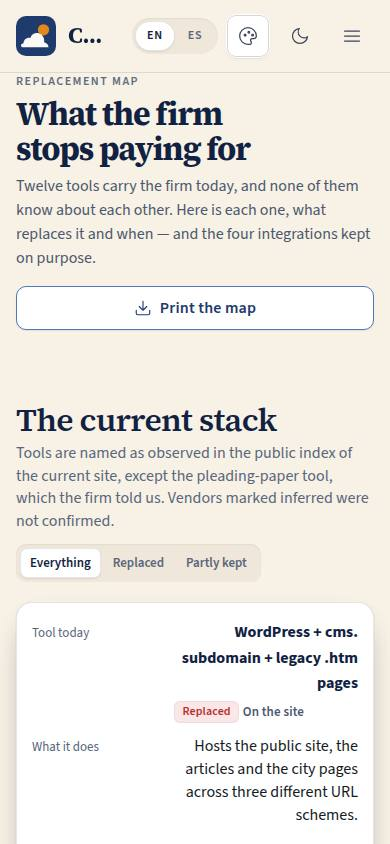
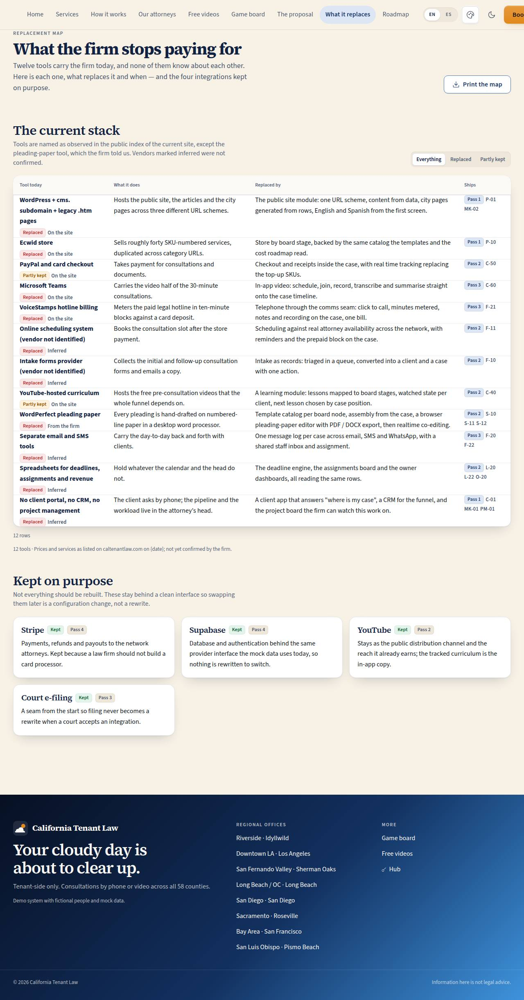

# P-03 · Replacement map

## Purpose

The money question, answered on one page: what does the firm stop paying for, and what takes its place? Twelve tools carry California Tenant Law today — the WordPress site and its legacy `.htm` twin, the Ecwid store, PayPal and card checkout, Microsoft Teams, the VoiceStamps hotline billing, an unidentified scheduler, an unidentified forms provider, the YouTube-hosted curriculum, WordPerfect pleading paper, separate email and SMS tooling, spreadsheets, and the absence of a portal, a CRM or project management. Each row says what the tool does today, why it hurts, the CTL OS module that replaces it and the pass it ships in. Four integrations are kept on purpose and named as seams.

## Screenshots

| 390 | 1280 |
| --- | --- |
|  |  |

Dark: `../screenshots/P-03/390-dark.jpg`, `../screenshots/P-03/1280-dark.jpg`.

## Sections (layout order)

1. **PageHeader** — eyebrow, title, lead, print action.
2. **The current stack** — the filter (everything / replaced / partly kept) and the table.
3. **Tool drawer** — what it does, why it hurts, what replaces it with its pass and page codes, what is kept, and how the fact was established.
4. **Kept on purpose** — Stripe, Supabase, YouTube and court e-filing as seams, with the pass each one lands in.

## Data

| Table | Read / write | Notes |
| --- | --- | --- |
| `tenants` | read | via SiteLayout. |

Rows live in `src/modules/site/proposalData.ts`; the pass column is read from `docs/plan/tasks.json` by page code.

## Rules

- `RULE-SYS-01` — every page specified, checked and documented.
- `RULE-SYS-02` — the replacement story is a data story: the same rows behind one provider.

## Actions (manifest)

| Id | Intent | Permission | Params | Live |
| --- | --- | --- | --- | --- |
| `site.filterReplacements` | show only the tools that are replaced or partly kept | none | `view: enum:all,replaced,partly` | yes |
| `site.openReplacement` | explain what replaces one tool and when | none | `toolId: string` | yes |
| `site.printReplacements` | print or save the replacement map | none | — | yes |

## Logic

- Every row carries how its fact was established: **On the site** (seen verbatim in the public index), **Inferred** (deduced from URLs, titles or partial snippets) or **From the firm** (told to us directly, which is how the WordPerfect row exists). Vendors that were never identified — the scheduler, the forms provider, the email and SMS tooling — are labelled as such and never named (D-025).
- The pass badge per row comes from `planFor(codes)`, so a change in the plan moves the map.
- Filtering to "replaced" or "partly kept" updates the table and the count line; an empty result shows an EmptyState with a way back.

## Components

SiteLayout, PageHeader, Section, Card, SegmentedControl, DataTable, Drawer, Badge, Button, EmptyState.

## Placeholders

None.

## Real vs mock

The stack is an observation of the public site (the site itself was unreachable from the build environment, D-025), not an audit. Spend figures are deliberately absent: nothing here claims what a tool costs the firm, only what it does and what replaces it. Pass 5 (T-112) settles the vendors and the prices.

## Inputs and responsive check (P-01, P-03)

Checked at 360, 390, 768, 1280, 1920, 2560 and 3840 in light and dark: 0 failing cells, 0 a11y findings. Below 768 px each tool becomes a card with labelled fields; above it the table shows every row without an inner scroll trap. Rows are keyboard-activatable (Enter opens the drawer) and the filter is a proper radio-style segmented control.

## Changelog

- `docs/changelog/0005-site-and-proposal.md`

## Resumen en español

El mapa de reemplazo: las doce herramientas que hoy sostienen al bufete, qué hace cada una, por qué duele, qué módulo de CTL OS la reemplaza y en qué fase. Cuatro integraciones se conservan a propósito (Stripe, Supabase, YouTube y la presentación electrónica ante la corte). Los proveedores no identificados aparecen marcados como inferidos y nunca se nombran.
