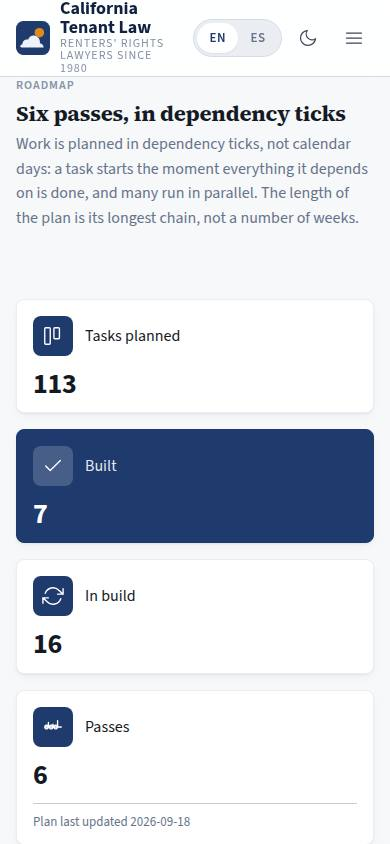
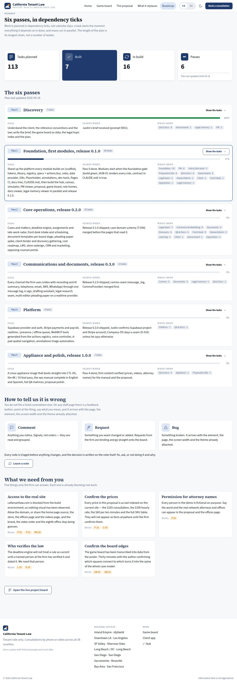

# P-04 · Client-facing roadmap

## Purpose

The plan, written for the firm rather than for the builders. Six passes, each with its goal, the gate that starts it, the areas it ships and live progress computed from task statuses. It explains why the plan is measured in dependency ticks and not calendar days, shows how to tell us something is wrong (annotations on the product itself, triaged before anything changes), and lists the five things only the firm can answer that are already blocking work.

## Screenshots

| 390 | 1280 |
| --- | --- |
|  |  |

Dark: `../screenshots/P-04/390-dark.jpg`, `../screenshots/P-04/1280-dark.jpg`.

## Sections (layout order)

1. **PageHeader** — eyebrow, title, and the ticks-not-days explanation as the lead.
2. **Stat tiles** — tasks planned, built, in build, number of passes (with the plan's last-updated date).
3. **The six passes** — one card per pass: badge, title, task count, progress bar, goal, gate, the areas it ships, and an expandable task table.
4. **How to tell us it is wrong** — the three annotation kinds (comment, request, bug) and how triage works.
5. **What we need from you** — the five open asks, each naming the page codes it blocks.
6. **Link** — the live project board.

## Data

| Table | Read / write | Notes |
| --- | --- | --- |
| `tenants` | read | via SiteLayout. |
| `feedback` | — | not read here; described. The annotation button that writes it lives on staff pages (A-05). |

`docs/plan/tasks.json` is imported at build time: passes, goals, gates, task titles, lanes and statuses.

## Rules

- `RULE-SYS-01` — every page specified, checked and documented; the progress numbers come from the same file the plan does.
- `RULE-SYS-03` — annotations are triaged and the decision recorded before anything changes; that is what the feedback section promises.

## Actions (manifest)

| Id | Intent | Permission | Params | Live |
| --- | --- | --- | --- | --- |
| `site.selectPass` | show what one pass of the plan delivers | none | `pass: number` | yes |
| `site.toggleTasks` | show or hide the task list of the open pass | none | — | yes |
| `site.giveFeedback` | comment on the product, request a change or report a bug | none | — | stub (public annotations, Pass 2) |

## Logic

- Progress per pass is `(done + 0.5 × in-build) / total`, rounded — deliberately simple and explained by the numbers next to it.
- "What ships" is the pass's lanes with their task counts, sorted by size, so a reader sees where the weight of a pass sits without reading 46 task titles.
- Units are dependency ticks (D-013): a task starts the moment everything it depends on is done, so the plan's length is its longest chain, not a number of weeks. The page says this in the lead rather than showing dates it cannot honour.
- The five asks mirror the "Awaiting Justin" section of `docs/kanban.md`.

## Components

SiteLayout, PageHeader, Section, Card, StatTile, DataTable, ProgressBar, Badge, Button, Icon, Placeholder.

## Placeholders

| Control | Planned in |
| --- | --- |
| Leave a note | public annotations, Pass 2 (A-05 ships the staff-side button now) |

## Real vs mock

Everything numeric on this page is real: it is the plan file, read at build time. Nothing is written. When a task's status changes in `tasks.json`, this page changes with it.

## Inputs and responsive check (P-01, P-03)

Checked at 360, 390, 768, 1280, 1920, 2560 and 3840 in light and dark: 0 failing cells, 0 a11y findings. The pass cards stack cleanly on a phone; the task table falls back to labelled cards under 768 px. The show/hide control is a button with `aria-expanded` that tracks the task list, not the selected pass.

## Changelog

- `docs/changelog/_pending/site.md`

## Resumen en español

El plan en el idioma del bufete: seis fases con su objetivo, su condición de inicio, lo que entrega cada una y el avance real calculado desde los estados de las tareas. Explica por qué se mide en pasos de dependencia y no en días, cómo dejar comentarios sobre el producto mismo y las cinco cosas que solo el bufete puede responder.
