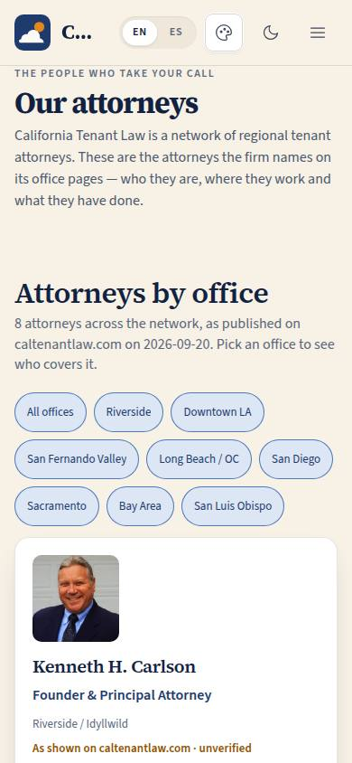

# P-05 · Our attorneys

## Purpose

The public team page. California Tenant Law is a network of regional tenant attorneys, and a frightened renter wants to know who would actually take their call and from where. The page shows every attorney the firm names on its own office pages — portrait, name, title, office and city, the first sentences of their bio — filterable by office, each card linking out to that office's page on caltenantlaw.com. Because none of it has been confirmed by the firm inside CTL OS yet, every card carries the badge "As shown on caltenantlaw.com · unverified" with the date it was read (D-046).

## Screenshots

| 390 | 1280 |
| --- | --- |
|  |  |

Dark: `../screenshots/P-05/390-dark.jpg`, `../screenshots/P-05/1280-dark.jpg`. TV: `../screenshots/P-05/3840.jpg`. (Captured with `npm run screenshots -- --codes=P-05` at integration; the build worker's checks used ad-hoc captures at all seven widths.)

## Sections (layout order)

1. **SiteLayout** — the public frame; "Our attorneys" is now a nav entry.
2. **PageHeader** — code P-05, eyebrow, title, lead.
3. **Office filter** — a chip group: "All offices" plus every office that has an attorney row, in the offices' own order. The choice is in the URL (`?office=<office slug>`).
4. **PersonCard grid** — portrait (or initials), name, title, office · city, unverified badge, bio excerpt, "Office page on caltenantlaw.com" (external).
5. **Source note** — what is published vs what is confirmed, and why a card can show initials instead of a photo.

## Data

| Table | Read / write | Notes |
| --- | --- | --- |
| `attorneys` | read | New table (`src/data/schema/people.ts`), seeded at build time from `docs/data/attorneys.json`; ordered by `order_index` (Ken Carlson first). `verified` is false on every row. |
| `tenants` | read | `kind = office`, for the office short name on each card and the filter chips. |

`office_tenant_id` is resolved in the seed from the office page slug (`/offices/bay-area` → `ten_bay`), so the attorney and the office in the footer are the same office row.

## Rules

- `RULE-INTAKE-01` — the page presents attorneys, never advice; the consultation is still the prepaid 30 minutes booked from P-01.

## Actions (manifest)

| Id | Intent | Permission | Params | Live |
| --- | --- | --- | --- | --- |
| `site.filterAttorneys` | show the attorneys of one office | none | `office: string` (office slug or `all`) | yes |
| `site.openAttorneyPage` | open an attorney's office page on caltenantlaw.com | none | `slug: string` | yes |

## Logic

- Rows are ordered by `order_index`; the filter narrows by `office_tenant_id` and is addressable (`/site/attorneys?office=sacramento`, D-034), so the landing page's office cards and a voice controller can link straight to one office.
- The office line joins the office short name and the city, but never repeats itself: when one contains the other ("San Diego · San Diego", "Long Beach / OC · Long Beach") only the longer name is shown.
- Portraits resolve through `import.meta.env.BASE_URL` + `brand/people/<slug>.png` (the same base-relative pattern `index.html` uses for the favicon), so they load at `https://imagine-os.github.io/cal-tenant-law/` as well as locally. Jeremy Cook has no portrait anywhere on the firm's site, so his card shows an initials Avatar — never a stand-in photograph of someone else.
- Every card badges its own `scraped_at` date; the tooltip explains that the firm has not confirmed the fact inside CTL OS (D-046).

## Components

SiteLayout, PageHeader, Section, **PersonCard** (new molecule), Avatar, Badge, Tooltip, Chip, EmptyState.

## Placeholders

None. Every control on this page does what it says.

## Real vs mock

Real: the eight attorneys, their titles, offices, cities, bio excerpts and seven of the eight portraits, all read off caltenantlaw.com on 2026-09-20 (`docs/data/attorneys.json`, evidence `scraped-live`) and all badged unverified. Mock: nothing. Not shown: bar numbers (they exist in `docs/data/offices.json` but stay out of the UI until a person confirms them). When Supabase lands the table is the same shape and the firm edits its own rows.

## Inputs and responsive check (P-01, P-03)

Checked at 360, 390, 768, 1280, 1920, 2560 and 3840 in light and dark, in English and Spanish: no horizontal overflow at any width, body text 16 px and up (28 px at 3840 through `--scale`), no text under 12 px. The filter chips carry a 44 px minimum target at every band (site rule, also lifting P-01's stage picker); the office-page link is a 44 px anchor with a 3 px focus ring and announces "(opens in a new tab)". Tab order is filter chips → card link per card. Nothing is revealed on hover: the badge's tooltip opens on focus too, and every fact on a card is always visible. The bio is clamped to four lines so a row of cards stays even; the full text is one click away on the office page.

## Changelog

- `docs/changelog/0025-site-people.md`

## Resumen en español

La página pública del equipo: los ocho abogados que el despacho nombra en las páginas de sus oficinas, con retrato (o iniciales cuando el sitio no publica foto), cargo, oficina, ciudad y un extracto de su biografía, filtrables por oficina y con enlace a la página de esa oficina. Cada tarjeta lleva la etiqueta "según caltenantlaw.com · sin verificar" hasta que el despacho confirme cada dato (D-046).
