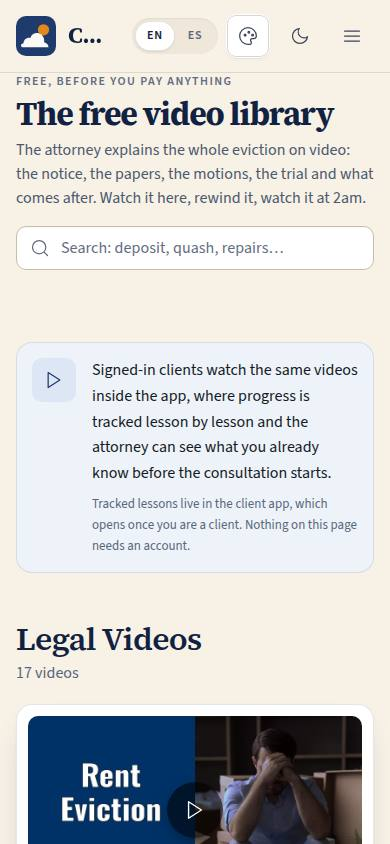
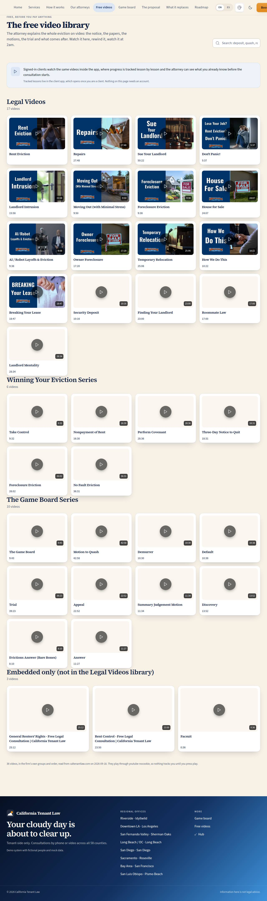

# P-06 · Free video library

## Purpose

"Watch it all first, for free" is the firm's actual funnel, and until now the public site only teased it. P-06 puts the whole library on one public page: the firm's 36 real videos in the site's own three series (Legal Videos, Winning Your Eviction Series, The Game Board Series) plus the three embedded on article pages, each with its thumbnail and running time, playing in place through youtube-nocookie, searchable. A signed-in client watches the same videos in the app where progress is tracked; nothing on this page needs an account.

## Screenshots

| 390 | 1280 |
| --- | --- |
|  |  |

Dark: `../screenshots/P-06/390-dark.jpg`, `../screenshots/P-06/1280-dark.jpg`. TV: `../screenshots/P-06/3840.jpg`.

## Sections (layout order)

1. **SiteLayout** — the public frame; "Free videos" is now a nav entry.
2. **PageHeader** — code P-06, eyebrow, title, lead, and the search field as the header action.
3. **Progress note** — a tinted card: tracked lessons live in the client app (the link renders only for the roles `/app/learn` allows; everyone else reads the note).
4. **Group sections** — one per series in the site's own order, each with its count; the embedded-only videos last.
5. **Video cards** — thumbnail with a play overlay and the duration, the title, the length; on play the thumbnail becomes the embed with a "close the player" control.
6. **Source note** — where the list came from and what the embed does.

## Data

| Table | Read / write | Notes |
| --- | --- | --- |
| `lessons` | read | `kind = video` only (the same table also holds the article lessons the client curriculum uses), ordered by `order`; seeded from `docs/data/videos.json` (live scrape, D-043). |
| `illustrations` | read | The bundled scrape of the firm's own video thumbnails, resolved through `src/data/illustrationAssets.ts`. |

## Rules

- `RULE-INTAKE-01` — the videos are education, not advice; the paid consultation stays the next step.

## Actions (manifest)

| Id | Intent | Permission | Params | Live |
| --- | --- | --- | --- | --- |
| `site.searchVideos` | find a video about something | none | `q: string` | yes |
| `site.playVideo` | play one of the free videos | none | `lessonId: string` (lesson id or YouTube id) | yes |
| `site.closeVideo` | stop the video that is playing | none | — | yes |

## Logic

- Grouping is the site's own (`group`, `group_order`); the three named series come first in the site's order, anything else ("Also on the articles") last. Each section prints its own count, and the counts follow the search.
- Thumbnails fall through three sources: the bundled scrape of the firm's own image (offline-safe), the image the firm's site serves, then YouTube's still for the video id. A card that fails to load one moves to the next and ends on a video glyph — never a broken image.
- Play swaps that card's thumbnail for a `youtube-nocookie.com/embed/<id>?rel=0&modestbranding=1` iframe. Only one player exists at a time (playing another closes the first), the iframe is created on click rather than on page load, and it does not autoplay: sound starts only when the viewer presses play inside the player. Focus moves into the player when it opens.
- Search matches title, series and presenter; with no match the page shows an empty state with a "show every video" reset.
- The "open my lessons in the app" link renders only when `hasRole(['client','super_admin'])`, because `/app/learn` is a client route — a public visitor would otherwise land on `/no-access` (D-048).

## Components

SiteLayout, PageHeader, Section, Card, SearchInput, Badge, Button, Icon, EmptyState.

## Placeholders

None.

## Real vs mock

Real: all 36 videos, their titles, series, order, running times, thumbnails and YouTube ids, from the firm's own site (`docs/data/videos.json`, scraped live 2026-09-18). The players are the firm's real YouTube uploads. Mock: nothing. Not here: watched state, the drip along the case journey and the pre-consultation check — those belong to the client app (C-03 / T-130) because they need an account.

## Inputs and responsive check (P-01, P-03)

Checked at 360, 390, 768, 1280, 1920, 2560 and 3840 in light and dark, English and Spanish: no horizontal overflow, body text 16 px and up, nothing under 12 px. Every thumbnail is a real button (16:9, far larger than 44 px) with an accessible name of "Play: <title> (<length>)", a visible focus ring, and a keyboard-reachable "close the player" beside it; the duration is text, not colour. Nothing is hover-only — the play overlay is always visible, hover only changes its tint. The embed carries the video title as its iframe title. Card grids use `auto-fit` with a `min(100%, …)` floor, so the library reflows from one column at 360 to four and more on a TV.

## Changelog

- `docs/changelog/_pending/site-people.md`

## Resumen en español

La biblioteca pública de videos: los 36 videos reales del despacho en sus tres series propias, con miniatura y duración, reproducibles en la misma página mediante youtube-nocookie (uno a la vez, creado al hacer clic, sin reproducción automática) y con búsqueda. Los clientes con sesión ven las mismas lecciones en la app, donde sí se registra el progreso.
