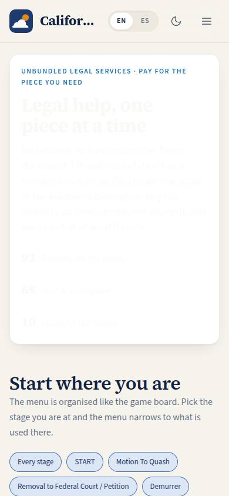

# P-10 · Services menu

## Purpose

The firm's whole menu of unbundled legal work on one page. California Tenant Law sells "piecemeal, like a legal vending machine, so you control the costs": ~90 SKU-numbered documents, kits and consultations, each one a piece of the eviction rather than a retainer. The current store lists them in Ecwid categories, duplicated across URLs, with no connection to where the case actually is. This page files every service under the stage of the game board it belongs to and answers the only two questions a frightened renter can actually answer — *where am I* and *how much is it* — without pretending any price is confirmed.

## Screenshots

| 390 | 1280 |
| --- | --- |
|  |  |

Dark: `../screenshots/P-10/390-dark.jpg`, `../screenshots/P-10/1280-dark.jpg`.

## Sections (layout order)

1. **Hero** — "Legal help, one piece at a time", the promise in the firm's voice, and three counts read from the catalog (services, services with a listed price, stages).
2. **StageStrip** — the game board's phases as chips in board order, plus "Every stage" and "Any stage" for the services that are not squares on the eviction board. The selection is the `?stage=` URL parameter.
3. **Toolbar** — search, price band (free / under $250 / $250–$600 / over $600 / not listed), how it is charged (flat, minimum, hourly, per 10 minutes, each, deposit, free), "compare the kits", and "clear filters" once anything is set. A count line says how many of the whole menu are showing.
4. **KitComparison** (toggled) — the Legal Kits category as one table: what it is, price, what you get, which square it is used at.
5. **CategorySections** — the store's own categories in the firm's order; each renders its services as cards. A category with nothing matching the filter is hidden.
6. **AsListedNote** — what "as listed" means, where the data came from, and links to the outline (P-13), P-12 and the board.

## Data

| Table | Read / write | Notes |
| --- | --- | --- |
| `service_categories` | read | 22 rows, ordered by `sort_order`; `phase` links a category to a board phase |
| `services` | read | 92 rows seeded from `docs/data/services-catalog.json`; only `active` rows render |

## Rules

- `RULE-CATALOG-01` — every price renders with the "as listed · unverified" badge and its tooltip until `services.verified` is set; a service with no indexed price says "price not listed", never `$0`.
- `RULE-CATALOG-02` — a service is shown under every stage its `phase` or its `stage_node_ids` put it in; the 22 services with no board square group under "Any stage".
- `RULE-CATALOG-03` — consultation before documents: the prerequisites line on a drafted document names the consultation.
- `RULE-CATALOG-06` — the time expectation and "you receive" lines on a card say "to be confirmed" where the site states nothing.

## Actions (manifest)

| Id | Intent | Permission | Params | Live |
| --- | --- | --- | --- | --- |
| `catalog.filterStage` | show the services for one stage of the eviction | `store.read` | `phase: string` | yes |
| `catalog.search` | search the services by name, SKU or board square | `store.read` | `q: string` | yes |
| `catalog.filterPrice` | show only services in a price band | `store.read` | `band: enum` | yes |
| `catalog.filterUnit` | show only flat-price, hourly or minimum-charge services | `store.read` | `unit: enum` | yes |
| `catalog.clearFilters` | show the whole menu again | `store.read` | — | yes |
| `catalog.compareKits` | compare the do-it-yourself legal kits side by side | `store.read` | — | yes |
| `catalog.openService` | open one service and everything about it | `store.read` | `sku: string` | yes |
| `catalog.addToPlan` | add this service to what I plan to buy | `store.buy` | `sku: string` | stub (T-080) |
| `catalog.openBoard` | show where this service fits on the game board | `board.read` | `nodeId: string` | yes |
| `catalog.openOutline` | see every service as one outline | `store.read` | — | yes |

## Logic

- Categories render in `sort_order`; a category with no matching row is skipped entirely, so the page never shows an empty heading.
- A service matches a stage if `phase === stage` **or** any of its `stage_node_ids` sits in that phase, so one SKU appears under several stages exactly as it does in the store.
- `?stage=<phase>` is read on mount and written back on every chip press, so P-01's stage picker, the board and a voice controller all deep-link to the same view.
- Search matches SKU, title, deliverable, "what you get", prerequisites, price note and the labels of the board squares the service is filed on.
- Price bands come from `price_cents`; "not listed" is its own band and never renders as free.
- The kit comparison is the Legal Kits category, not a hard-coded list of SKUs.

## Components

`SiteLayout` (through the site module's `SiteFrame`), `Section`, `Card`, `DataTable`, `SearchInput`, `SegmentedControl`, `Select`, `Chip`, `Badge`, `Button`, `Tooltip`, `Placeholder`, `EmptyState`, `Icon`. Module-local compositions in `catalogChrome.tsx`: `SkuPill`, `PriceTag`, `UnverifiedBadge`, `BoardLinks`, `ServiceCard`.

## Placeholders

- **Add to plan** on every card — the cart and checkout are T-080 (Pass 2).

## Real vs mock

The catalog is real data reconstructed from indexed search results (`docs/data/services-catalog.json`, 22 categories / 92 services / 68 priced); the live site was unreachable from the build environment, so nothing was read from a page and every row is `verified: false`. Board squares and phases are the real poster data. Buying is not wired. When Supabase lands the rows move behind the same provider interface and the JSON becomes the migration seed.

## Inputs and responsive check (P-01, P-03)

Checked at: 360, 390, 768, 1280, 1920, 2560, 3840, light and dark. Chips, search, the band switch, the unit select and the compare button are all keyboard reachable in reading order; the unverified badge is a `Tooltip`, so it opens on focus and on touch, never hover only. Cards are a single column at 360/390 and 380 px minimum from 1920 so the 4K view uses the width for more cards rather than more whitespace.

## Changelog

- `docs/changelog/_pending/catalog.md` (0.1.1)

## Resumen en español

El menú completo de servicios del bufete, organizado por la etapa del tablero a la que pertenece cada uno: documentos, kits y consultas con su número de SKU y su precio "según el sitio, sin verificar". Para el inquilino que quiere saber qué sigue y cuánto cuesta, sin contratar a un abogado por horas.
