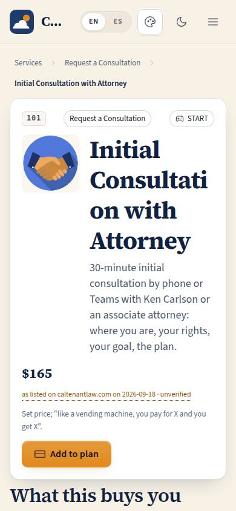
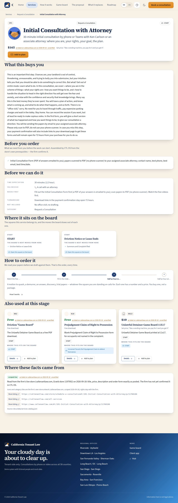

# P-11 · Service detail

## Purpose

Everything about one piece of work, before anyone pays for it. A renter deciding whether to spend $250 on a motion to quash needs four things the current store does not give them: what the document actually is, what has to be true before we can draft it, where it sits in the sequence of the case, and where the price came from. This page answers all four on one screen, and says plainly when a fact was reconstructed rather than quoted.

## Screenshots

| 390 | 1280 |
| --- | --- |
|  |  |

Dark: `../screenshots/P-11/390-dark.jpg`, `../screenshots/P-11/1280-dark.jpg`. The screenshot route is SKU 101 (the initial consultation).

## Sections (layout order)

1. **Breadcrumbs** — all services → the category → this service.
2. **Header** — SKU pill, category and stage chips, title, the deliverable as the lead, the price with its note and the "as listed · unverified" badge, "Add to plan" and (on anything but the consultation) "Start with the consultation".
3. **WhatYouGet** — the plain-language paragraph in the firm's voice.
4. **BeforeYouOrder** — `client_inputs`: what the client has to provide before the work can start (the completed intake form, a copy of the notice, the summons and complaint). An empty list reads "nothing — buy it and download it"; an unknown one reads "to be confirmed".
5. **Requirements** — time expectation, what you receive (the deliverable format with its icon), prerequisites, turnaround and category as a definition list.
6. **BoardExcerpt** — one card per board square the service is filed on: the phase, the square's label, the moves the board draws out of it, and a link that opens GB-01 on that square.
7. **HowToOrder** — the funnel as a `Stepper`, ending on this service, with a link to P-12.
8. **RelatedServices** — up to three other services that share a stage, cheapest first.
9. **Sources** — the evidence flag (`scraped-live`), the date the live store was read, the store URLs, and the provenance of the firm's product icon.

## Data

| Table | Read / write | Notes |
| --- | --- | --- |
| `services` | read | matched on `sku`, case-insensitively |
| `service_categories` | read | for the breadcrumb and the category line |

Board squares and their outgoing moves are read from `docs/game-board/nodes.json` through the board module's index, never copied.

## Rules

- `RULE-CATALOG-01` — the price carries its note and the "as listed on caltenantlaw.com on 2026-09-18 · unverified" badge; "price not listed" would show if the store posted none (none today).
- `RULE-CATALOG-02` — the board excerpt, or an explicit "not a square on the eviction board" when `stage_node_ids` is empty.
- `RULE-CATALOG-03` — "how to order" always puts the videos, the intake form and the consultation before the document.
- `RULE-CATALOG-06` — time expectation, what you receive and what you provide render "to be confirmed" wherever the current site does not state them, never a plausible default.

## Actions (manifest)

| Id | Intent | Permission | Params | Live |
| --- | --- | --- | --- | --- |
| `catalog.openService` | open another service at this stage | `store.read` | `sku: string` | yes |
| `catalog.addToPlan` | add this service to what I plan to buy | `store.buy` | `sku: string` | stub (T-080) |
| `catalog.openBoard` | show where this service fits on the game board | `board.read` | `nodeId: string` | yes |
| `catalog.bookConsult` | start with the initial attorney consultation | `consultations.book` | — | yes (opens SKU 101) |

## Logic

- An unknown `:sku` renders an `EmptyState` with a link back to the menu rather than a blank page.
- Related services are the other active services sharing any phase with this one, sorted by price ascending, unpriced last, capped at three.
- The board excerpt lists the outgoing edges of each square verbatim from the poster data. No advice is generated: it says what the board says.
- `client_inputs` is CTL OS's structured reading of the store's own prerequisites plus the case papers a filing on a board square necessarily needs; the section says so, and the firm confirms it.
- The evidence line says the row was read from the firm's live store on 2026-09-18 (`scraped-live`, D-038); the 0.1.0 `verified-snippet` / `inferred` wording remains only for rows a future file might carry. "Not included" appears when the store's description states what the item does not cover (56 of 98); the header shows the firm's own product icon (D-042).

## Components

`SiteLayout`, `Breadcrumbs`, `Section`, `Card`, `Stepper`, `Chip`, `Badge`, `Button`, `Tooltip`, `Placeholder`, `EmptyState`, `Icon`, plus `PriceTag` / `SkuPill` / `UnverifiedBadge` / `ServiceCard` from `catalogChrome.tsx`.

## Placeholders

- **Add to plan** — the cart and checkout are T-080 (Pass 2).

## Real vs mock

Service rows, board squares and moves are real data. The source links point at the store URL patterns recorded during the research pass; they were never fetched (the domain is blocked from the build environment), which is why every row is `verified: false`. Ordering is not wired.

## Inputs and responsive check (P-01, P-03)

Checked at: 360, 390, 768, 1280, 1920, 2560, 3840, light and dark. The definition list collapses to one column under 480; source links are 28 px tall so they clear the 24 px target-size check; the unverified badge is focusable and its tooltip opens on focus.

## Changelog

- `docs/changelog/_pending/catalog.md` (0.1.1)

## Resumen en español

Todo sobre un servicio: qué es, qué necesitas antes, dónde encaja en el tablero, qué cuesta según el sitio y de dónde salió ese dato. Para decidir sin llamar a nadie.
