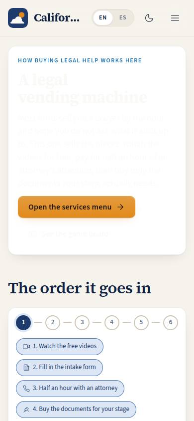
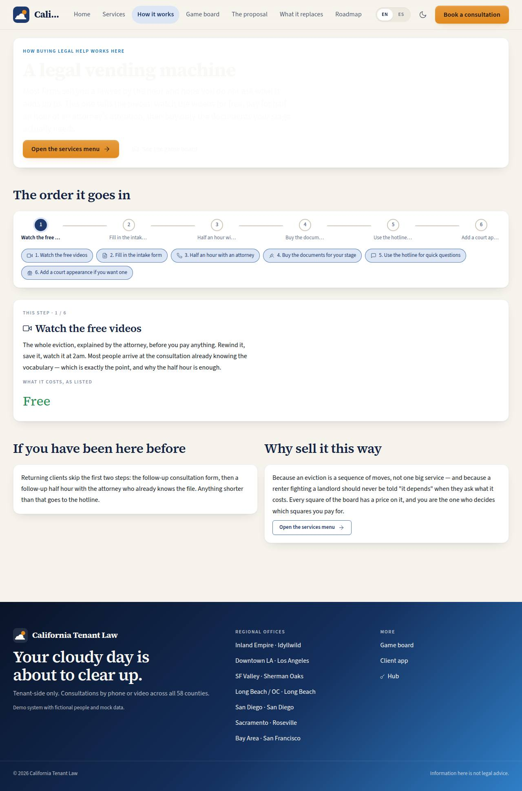

# P-12 · How it works

## Purpose

The vending machine explained. The firm's model is unusual enough that it has to be stated before the menu makes sense: watch the videos for free, pay for half an hour of an attorney's attention, then buy only the documents your square of the board calls for. This page draws that funnel as a stepper, names the SKU behind every paid step, reads its price from the catalog so the two can never disagree, and shows the returning-client path and the hotline.

## Screenshots

| 390 | 1280 |
| --- | --- |
|  |  |

Dark: `../screenshots/P-12/390-dark.jpg`, `../screenshots/P-12/1280-dark.jpg`.

## Sections (layout order)

1. **Hero** — "A legal vending machine", the idea in one paragraph, and the two ways on (the menu, the board).
2. **FunnelStepper** — six steps: free videos → intake form → 30-minute consultation → the documents for your stage → the hotline for quick questions → a court appearance if you want one. Both a `Stepper` and a chip row select the step.
3. **StepDetail** — what happens at the selected step, what it costs "as listed" (with the SKUs that back it, linked to P-11), and the step's own control (the intake-form Placeholder on step 2, the menu link on step 4).
4. **ReturningClient** — the second funnel: follow-up form, follow-up consultation, hotline.
5. **WhySellItThisWay** — the argument in the firm's voice, with a link into the menu.

## Data

| Table | Read / write | Notes |
| --- | --- | --- |
| `services` | read | prices for the steps, looked up by SKU (101, 400 / 370 / 150, HOTLINE, 450) |
| `service_categories` | read | through the shared catalog hook |

## Rules

- `RULE-CATALOG-03` — this page *is* the rule: consultation before documents, stated as the order of the steps.
- `RULE-CATALOG-01` — every figure on the page is a catalog price with the unverified badge.

## Actions (manifest)

| Id | Intent | Permission | Params | Live |
| --- | --- | --- | --- | --- |
| `catalog.openStep` | explain one step of how buying legal help works | — | `step: number` | yes |
| `catalog.openCatalog` | open the services menu, optionally at one stage | `store.read` | `phase: string` | yes |
| `catalog.bookConsult` | start with the initial attorney consultation | `consultations.book` | — | yes |
| `catalog.openBoard` | open the eviction game board | `board.read` | — | yes |

## Logic

- Step prices are read from the catalog rows by SKU; a SKU that is not in the catalog is simply not listed rather than rendered as a gap.
- Steps 1 and 2 are free and say so; the rest show `PriceTag`s.
- The stepper and the chip row drive the same state, so the page works with a pointer, a keyboard and (soon) a d-pad.

## Components

`SiteLayout`, `Section`, `Card`, `Stepper`, `Chip`, `Button`, `Icon`, `Placeholder`, plus `PriceTag` from `catalogChrome.tsx`.

## Placeholders

- **Fill in the intake form** on step 2 — F-10 intake forms (Pass 2).

## Real vs mock

The funnel is the firm's own, from `docs/reference/firm-site-digest.md` §4; the prices are catalog rows, unverified. The intake form and the scheduler do not exist yet.

## Inputs and responsive check (P-01, P-03)

Checked at: 360, 390, 768, 1280, 1920, 2560, 3840, light and dark. The stepper hides its labels on phones (the chip row carries them); the two closing sections sit side by side from 768.

## Changelog

- `docs/changelog/_pending/catalog.md` (0.1.1)

## Resumen en español

Cómo se compra ayuda legal aquí, paso a paso: videos gratis, formulario, media hora con un abogado, y después solo los documentos que tu etapa necesita. Con el precio de cada paso según el sitio.
