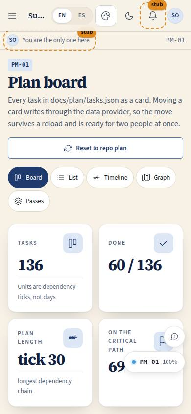
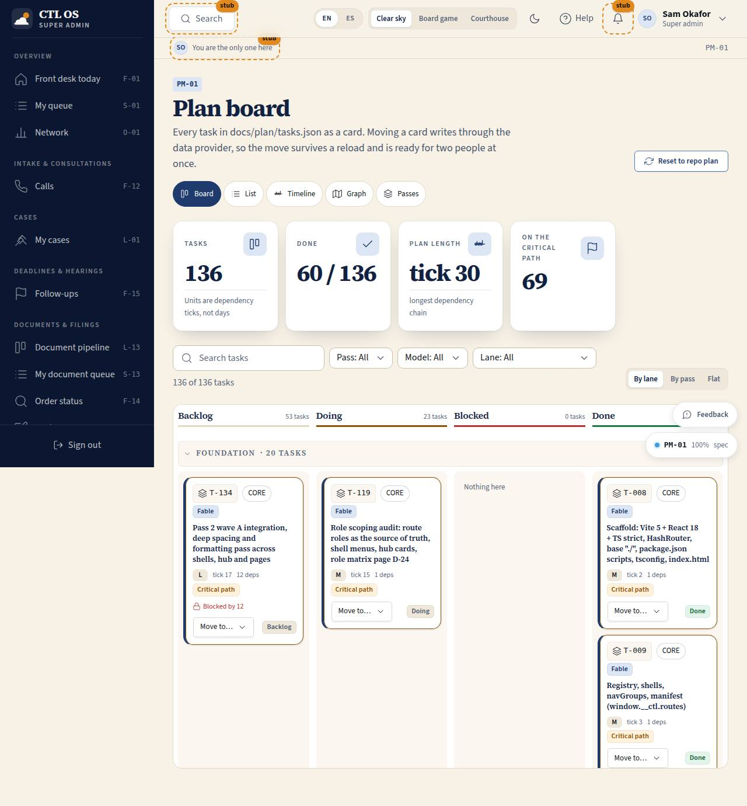

# PM-01 · Plan board

## Purpose

The team (and Justin) see the build plan of CTL OS itself as a kanban board: every task in `docs/plan/tasks.json` as a card, four columns (Backlog, Doing, Blocked, Done), swimlanes per lane or per pass, and filters for pass, model, lane and a search word. Moving a card is a real write through the `DataProvider`, so it survives a reload and is ready for two people at once (P-14); "Reset to repo plan" puts every task back to what the repo says.

Access (D-048, 2026-09-20): `super_admin` and `owner` (was every staff role). The plan is a leadership surface; the proposal pages embed plan data at build time, so nobody else needs the route.

## Screenshots

| 390 | 1280 |
| --- | --- |
|  |  |

Dark: `../screenshots/PM-01/390-dark.jpg`, `../screenshots/PM-01/1280-dark.jpg`. TV: `../screenshots/PM-01/3840.jpg`.

## Sections (layout order)

1. PageHeader - title, "Reset to repo plan", the five plan views (board, list, timeline, graph, passes)
2. StatTiles - tasks, done, plan length in **dependency ticks**, tasks on the critical path
3. Filter bar - search, pass, model, lane, result count, clear; grouping switch (by lane / by pass / flat)
4. Board - sticky column header row with per-column counts, then one collapsible swimlane per group with four columns
5. TaskDetailDrawer - the selected task (`?task=T-nnn`)

## Data

| Table | Read / write | Notes |
| --- | --- | --- |
| `plan_tasks` | read + write | `status` on a move; `blocked_by_ids` recomputed for the dependents of the moved task |
| `plan_passes` | read | swimlane titles when grouping by pass |
| `plan_lanes` | read | lane order and the icon on each card |

## Rules

- `RULE-SYS-01` - the system explains itself: the plan of the product is inside the product.

## Actions (manifest)

| Id | Intent | Permission | Params | Live |
| --- | --- | --- | --- | --- |
| `plan.moveTask` | move a task to another column | `projects.write` | `id: id, status: enum` | yes |
| `plan.filter` | filter the plan by pass, model, lane or a search word | `projects.read` | `pass, model, lane, q` | yes |
| `plan.setGrouping` | group the board by lane, by pass or not at all | none | `grouping: enum:lane,pass,flat` | yes |
| `plan.selectTask` | open the detail of a task | none | `id: id` | yes |
| `plan.toggleLane` | collapse or expand a swimlane | none | `lane: string` | yes |
| `plan.resetFromRepo` | reset every task to the status in `docs/plan/tasks.json` | `projects.write` | — | yes |

## Logic

- **Ticks, not days** (D-013): `tick(t) = 0` without dependencies, else `1 + max(tick(dep))`. The plan length is the deepest chain (28 ticks today), never a number of weeks.
- Critical path = every task whose depth + forward height equals the plan span; those cards carry a "Critical path" badge and a warm outline.
- A card shows "Blocked by n" when a dependency is not `done`; the set is recomputed on every status write, never read stale.
- A move calls `update('plan_tasks', id, { status })` and then re-derives `blocked_by_ids` for the dependents of that task.
- Filters and the open task live in the query string (`/#/plan?pass=1&model=opus-5&task=T-030`), so a view is addressable by a person, an agent or a voice controller (P-06).

## Components

PageHeader, StatTile, SearchInput, Select, SegmentedControl, Chip, Badge, StatusBadge, Button, Tooltip, Drawer, DependencyChip, EmptyState, Icon.

## Placeholders

None: every control on this page works.

## Real vs mock

Real: the plan data (imported from the repo at build time), the tick and critical-path maths, every write. Mock: the `MockProvider`'s localStorage store (`ctl.db.v1`) - with Supabase the same writes become rows with RLS and the board becomes multi-user live.

## Inputs and responsive check (P-01, P-03)

Checked at 360, 390, 768, 1280, 1920, 2560, 3840 in light and dark (`npm run qa:responsive -- --only=/plan`: 84 cells, 0 failing, 0 a11y findings). Four columns at >= 1100 px, two below, one under 700 px. Cards are draggable **and** every card has a keyboard "Move to…" menu (portal, so the board's scroll container never clips it); nothing is drag-only and nothing is hover-only. The board scrolls inside its own region so the page stays short; the column header row is sticky. Targets are >= 44 px.

## Changelog

- `docs/changelog/0004-plan-viewer.md`

## Resumen en español

El plan de construcción de CTL OS como tablero kanban: cada tarea de `docs/plan/tasks.json` es una tarjeta con su id, código de página, modelo, tamaño y dependencias; las columnas son Pendiente, En curso, Bloqueado y Hecho, con carriles por línea de trabajo o por pasada. Mover una tarjeta escribe en el proveedor de datos (persiste y admite varias personas); "Restaurar el plan del repo" vuelve al estado del repositorio. Las unidades son ticks de dependencia, no días.
