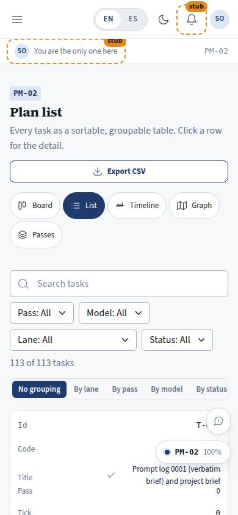
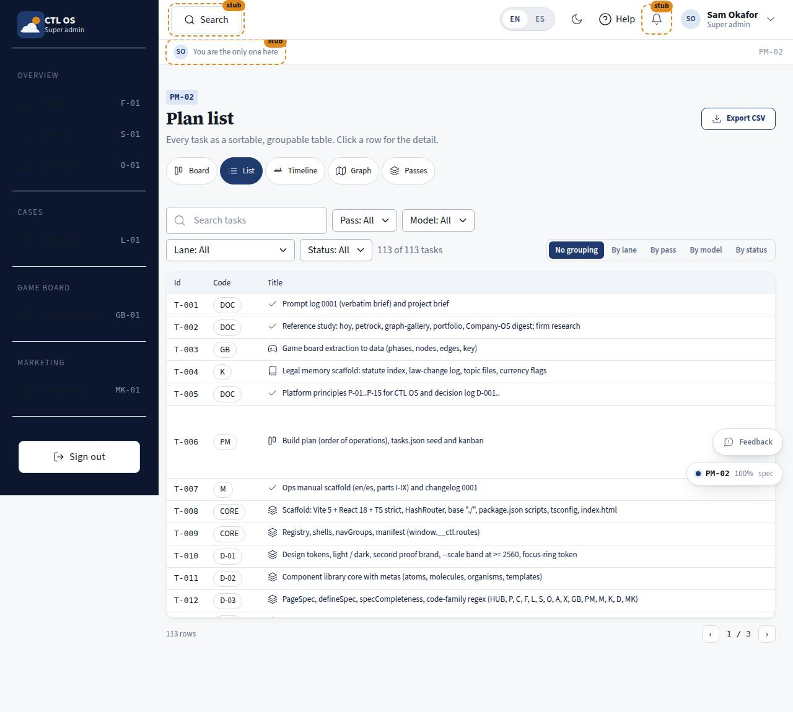

# PM-02 · Plan list

## Purpose

The same plan as a table for people who want to scan, sort and compare: every task with its id, page code, title, lane, pass, tick, model, status, size and dependency ids, sortable on every column, groupable by lane / pass / model / status, searchable, and exportable as CSV. A row click opens the task detail.

## Screenshots

| 390 | 1280 |
| --- | --- |
|  |  |

Dark: `../screenshots/PM-02/390-dark.jpg`, `../screenshots/PM-02/1280-dark.jpg`.

## Sections (layout order)

1. PageHeader - title, "Export CSV", plan views
2. Filter bar (search, pass, model, lane, status) + grouping switch
3. DataTable - id, code, title, lane, pass, tick, model, status, size, depends on
4. TaskDetailDrawer

## Data

| Table | Read / write | Notes |
| --- | --- | --- |
| `plan_tasks` | read (write from the drawer) | the drawer's "Move to…" writes the status |
| `plan_passes`, `plan_lanes` | read | filter options |

## Rules

- `RULE-SYS-01`

## Actions (manifest)

| Id | Intent | Permission | Params | Live |
| --- | --- | --- | --- | --- |
| `plan.filter` | filter the task list | `projects.read` | `pass, model, lane, status, q` | yes |
| `plan.setGrouping` | group the table by lane, pass, model or status | none | `grouping: enum` | yes |
| `plan.selectTask` | open the detail of a task | none | `id: id` | yes |
| `plan.exportCsv` | download the filtered tasks as a CSV file | `projects.read` | — | yes |

## Logic

- Sorting and grouping happen in the library DataTable; grouping buckets rows inside one table with a collapsible label row per group.
- The dependency cell colours each id: green when that dependency is done, red while it is not.
- CSV contains the filtered rows only, columns `id, code, title, lane, pass, tick, model, status, size, depends_on`.

## Components

PageHeader, DataTable, SearchInput, Select, SegmentedControl, Chip, Badge, StatusBadge, Button, Drawer, Icon.

## Placeholders

None.

## Real vs mock

Real: every row and the export. Mock: the localStorage store behind the provider.

## Inputs and responsive check (P-01, P-03)

Checked at 360, 390, 768, 1280, 1920, 2560, 3840, light and dark. Under 768 px the DataTable renders each row as a card. The five-option grouping switch scrolls inside itself on a 360 px phone so the page never scrolls sideways.

## Changelog

- `docs/changelog/_pending/plan.md`

## Resumen en español

Todas las tareas del plan en una tabla ordenable, agrupable (por carril, pasada, modelo o estado) y con búsqueda, con exportación a CSV y detalle al pulsar una fila.
