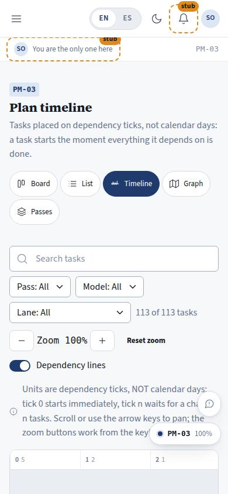
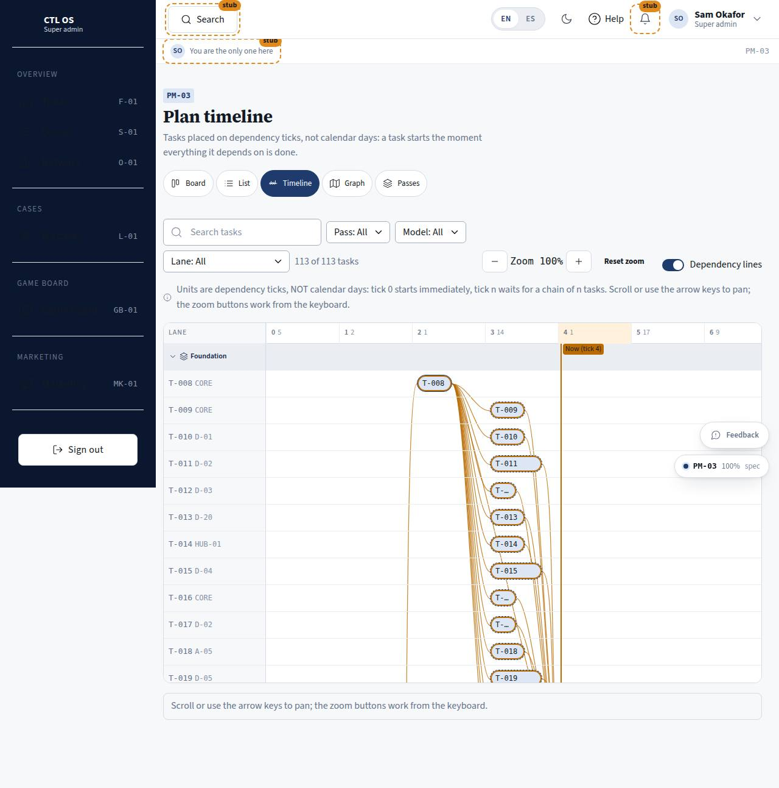

# PM-03 · Plan timeline

## Purpose

The shape of the plan in time-that-is-not-time: the x axis is the **dependency tick**, not a calendar day (D-013). One row per task inside collapsible lanes, bars sized by S/M/L/XL, SVG dependency lines between the bars, the critical path lit, the parallel count at each tick, and "now" drawn at the highest tick that holds a task in progress.

## Screenshots

| 390 | 1280 |
| --- | --- |
|  |  |

Dark: `../screenshots/PM-03/390-dark.jpg`, `../screenshots/PM-03/1280-dark.jpg`.

## Sections (layout order)

1. PageHeader + plan views
2. Filter bar, zoom (−, level, +, reset), dependency-lines toggle
3. Units note ("dependency ticks, NOT calendar days") and the panning hint
4. Chart - sticky lane column, sticky tick axis with the parallel count per tick, lane bands, bars, dependency links, the "now" line
5. Hover / focus detail strip (`role="status"`, so it also announces to a screen reader)

## Data

| Table | Read / write | Notes |
| --- | --- | --- |
| `plan_tasks` | read (write from the drawer) | |
| `plan_lanes` | read | lane order, collapse state, icons |
| `plan_passes` | read | filter labels |

## Rules

- `RULE-SYS-01`

## Actions (manifest)

| Id | Intent | Permission | Params | Live |
| --- | --- | --- | --- | --- |
| `plan.zoom` | zoom the timeline in, out or back to 100 % | none | `direction: enum:in,out,reset` | yes |
| `plan.filter` | filter the timeline | `projects.read` | `pass, model, lane, q` | yes |
| `plan.selectTask` | open the detail of a task | none | `id: id` | yes |
| `plan.toggleLane` | collapse or expand a lane | none | `lane: string` | yes |
| `plan.toggleLinks` | show or hide the dependency lines | none | — | yes |

## Logic

- x = `tick * columnWidth`; column width = 120 px x zoom x the `--scale` band, so a 4K screen gets a bigger chart, not a smaller one.
- Bar length = `SIZE_WEIGHT[size]` (S 1, M 1.6, L 2.4, XL 3.2) x 30 % of the column, minimum 44 px: relative size, never hours.
- "Now" = the highest tick that has a task with status `doing`.
- The parallel count under each tick number is how many filtered tasks share that tick - the plan's width at that moment.
- A dependency line is drawn from the right edge of the dependency's bar to the left edge of the dependent's bar; critical pairs are warm, the selected or hovered task's lines are primary and thicker.

## Components

PageHeader, Button, Toggle, Badge, SearchInput, Select, EmptyState, Drawer, Icon.

## Placeholders

None.

## Real vs mock

Real: every position, line and count, computed from the repo plan. Mock: the store behind the provider.

## Inputs and responsive check (P-01, P-03)

Checked at 360, 390, 768, 1280, 1920, 2560, 3840, light and dark. The chart has its own scroll region (max 74 vh) with a sticky lane column and a sticky tick axis; the page itself never scrolls sideways. Panning works with the trackpad **and** the arrow keys, zoom with buttons **and** `+` / `-`; the region is focusable with a visible ring. Every bar is a focusable button with a full aria-label, and the detail strip repeats what hover shows, so nothing is hover-only. Under 700 px the lane column is hidden and the bars carry the ids.

## Changelog

- `docs/changelog/_pending/plan.md`

## Resumen en español

El plan sobre ticks de dependencia (no días): una fila por tarea dentro de carriles plegables, barras según el tamaño, líneas de dependencia en SVG, ruta crítica resaltada, cuántas tareas caben en paralelo en cada tick y una marca de "ahora". Zoom con botones y teclado; desplazamiento con ratón, táctil o flechas.
