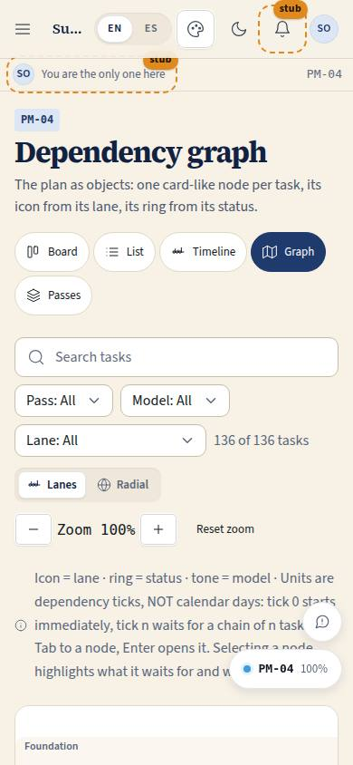
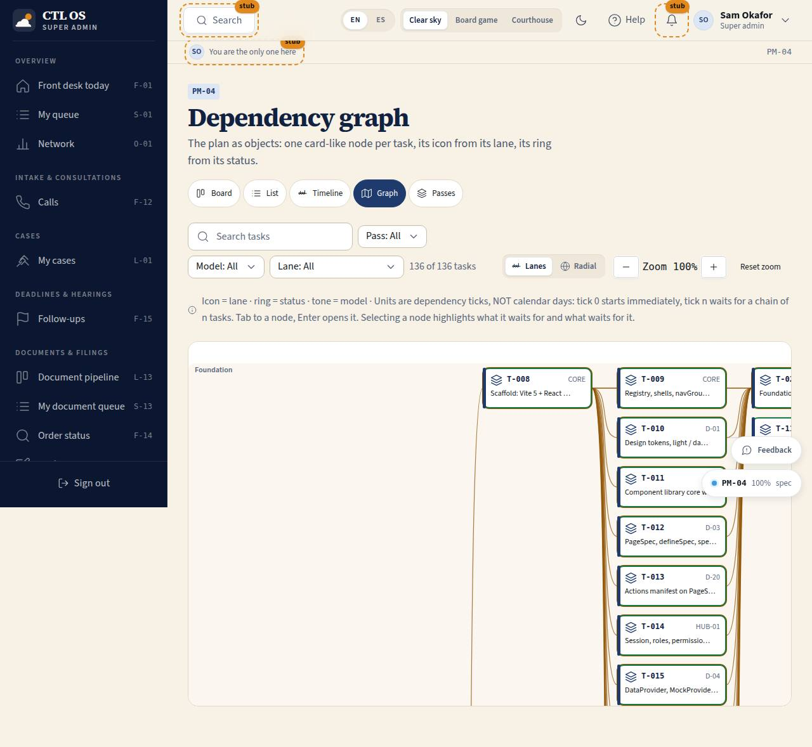

# PM-04 · Dependency graph (object view)

## Purpose

The dependency graph as an **object view**, the way Justin asked for it: "I always like object views so that it's more clear what each node actually is based on its icon or preview." Every task is a card-like node you can identify without reading it - the icon comes from its lane, the left tone bar from its model, the ring from its status, and the page code sits on the node. Two layouts switch in place: **lanes** (a swimlane per lane, a column per dependency tick, after the graph-gallery lanes skill-tree) and **radial** (passes as rings, lanes as sectors, after the radial tree). Selecting a node lights everything it waits for and everything waiting on it.

Access (D-048, 2026-09-20): `super_admin` and `owner` (was every staff role).

## Screenshots

| 390 | 1280 |
| --- | --- |
|  |  |

Dark: `../screenshots/PM-04/390-dark.jpg`, `../screenshots/PM-04/1280-dark.jpg`. TV: `../screenshots/PM-04/3840.jpg`.

## Sections (layout order)

1. PageHeader + plan views
2. Filter bar, layout switch (Lanes / Radial), zoom
3. Legend ("icon = lane · ring = status · tone = model") and the selection summary (upstream / downstream counts)
4. SVG canvas - lane bands or pass rings and lane sectors, dependency edges, object nodes
5. TaskDetailDrawer

## Data

| Table | Read / write | Notes |
| --- | --- | --- |
| `plan_tasks` | read (write from the drawer) | |
| `plan_lanes` | read | lane order and the node icon |
| `plan_passes` | read | rings in the radial layout |

## Rules

- `RULE-SYS-01`

## Actions (manifest)

| Id | Intent | Permission | Params | Live |
| --- | --- | --- | --- | --- |
| `plan.setLayout` | switch between the lanes and the radial layout | none | `layout: enum:lanes,radial` | yes |
| `plan.zoom` | zoom the graph | none | `direction: enum:in,out,reset` | yes |
| `plan.selectTask` | select a task node and show what it waits for | none | `id: id` | yes |
| `plan.filter` | filter the graph | `projects.read` | `pass, model, lane, q` | yes |

## Logic

- **Lanes layout**: y band per lane (height = the deepest stack in that lane), x column per tick (`nodeWidth + gap`), tasks sharing a cell stack vertically; edges are cubic beziers from the right of the dependency to the left of the dependent.
- **Radial layout**: ring radius per pass (`120 + n x 108`), angular sector per lane, tasks spread evenly inside their sector; edges bow toward the centre.
- Selecting computes the transitive upstream (`depends_on` closure) and downstream (reverse closure) sets; everything else dims.
- All layout maths is written in `src/modules/plan/GraphPage.tsx` and `planGraph.ts` - **pure SVG and React, no d3 and no new dependency**. Node geometry multiplies by the live `--scale` band so 2560 / 3840 get bigger nodes, not smaller text.
- Node icons reuse the library `ICONS` path registry, so the graph and the rest of the app share one icon vocabulary.

## Components

PageHeader, SegmentedControl, Button, Badge, SearchInput, Select, EmptyState, Drawer, Icon (icon paths).

## Placeholders

None. (A 3D object view of the plan is not in this pass; the game board owns the 3D work, T-076.)

## Real vs mock

Real: nodes, edges, layouts and the highlighting. Mock: the store behind the provider.

## Inputs and responsive check (P-01, P-03)

Checked at 360, 390, 768, 1280, 1920, 2560, 3840, light and dark. Every node is a focusable `role="button"` with a full aria-label; Enter / Space opens the detail. The canvas is a focusable scroll region that pans with the arrow keys as well as the trackpad, and zoom is on buttons, never wheel-only. Nodes are far larger than 44 px.

## Changelog

- `docs/changelog/0004-plan-viewer.md`

## Resumen en español

El grafo de dependencias como vista de objetos: cada tarea es un nodo con icono según su carril, tono según su modelo y anillo según su estado. Dos disposiciones: carriles (un carril por línea de trabajo, una columna por tick) y radial (anillos por pasada, sectores por carril). Al seleccionar un nodo se resalta todo lo que espera y todo lo que lo espera. SVG puro, sin dependencias nuevas; navegable con teclado.
