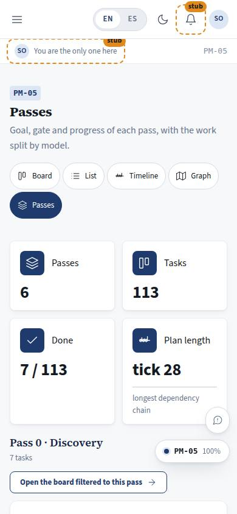
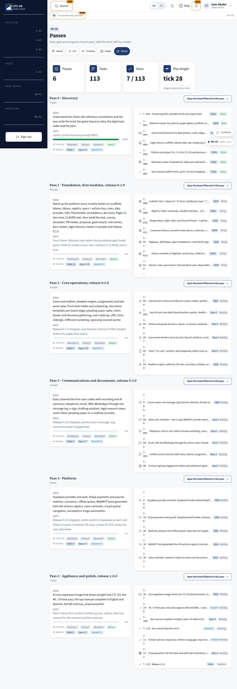

# PM-05 · Passes overview and task detail

## Purpose

Two views that share one page code. **`/plan/passes`** answers "where are we?": each pass with its goal, its gate, a progress bar, the counts per status and per model, and the list of its tasks. **`/plan/task/:id`** answers "what is this task?": every field of the repo plan, dependencies and dependents as links, deliverables with a link to the page doc and to the page itself, acceptance, notes and a status control that writes through the provider.

## Screenshots

| 390 | 1280 |
| --- | --- |
|  |  |

Dark: `../screenshots/PM-05/390-dark.jpg`, `../screenshots/PM-05/1280-dark.jpg`.

## Sections (layout order)

Passes: 1. PageHeader + plan views · 2. StatTiles (passes, tasks, done, plan length in ticks) · 3. One Section per pass: goal, gate, progress bar, counts by status, counts by model, the pass's task list.

Task: 1. PageHeader (back, page code, "Open page" when the code has a route) · 2. Badges (status, model, lane, pass, tick, size, critical path) · 3. Status control · 4. Dependencies and dependents · 5. Deliverables, acceptance, notes.

## Data

| Table | Read / write | Notes |
| --- | --- | --- |
| `plan_tasks` | read + write | the status control writes by id |
| `plan_passes` | read | goal, gate, title |
| `plan_lanes` | read | icons |

## Rules

- `RULE-SYS-01`

## Actions (manifest)

| Id | Intent | Permission | Params | Live |
| --- | --- | --- | --- | --- |
| `plan.selectPass` | open the board filtered to one pass | none | `pass: number` | yes (passes) |
| `plan.selectTask` | open the detail page of a task | none | `id: id` | yes |
| `plan.moveTask` | set the status of this task | `projects.write` | `id, status` | yes (task) |
| `plan.openPage` | open the page a task delivers, by page code | none | `code: string` | yes (task) |

## Logic

- Progress per pass = done tasks / tasks in that pass.
- A dependency chip is dashed while that dependency is not done.
- A deliverable named `docs/pages/<CODE>.md` gets a "Page doc" link, and when `<CODE>` has a route in `window.__ctl.routes` it also gets an "Open page" link to `/#/<route>`.
- An unknown id renders the "Task not found" empty state with a way back to the board (this is also what the QA matrix visits for `/plan/task/:id`).

## Components

PageHeader, Section, Card, StatTile, ProgressBar, SegmentedControl, DependencyChip, Badge, Chip, StatusBadge, Button, EmptyState, Icon.

## Placeholders

None.

## Real vs mock

Real: every field, link and write. Mock: the store behind the provider.

## Inputs and responsive check (P-01, P-03)

Checked at 360, 390, 768, 1280, 1920, 2560, 3840, light and dark, including the "task not found" state of `/plan/task/:id`. The status control is a SegmentedControl (keyboard radio group), every link and button is >= 44 px, headings run h1 → h2 → h3 without a skip.

## Changelog

- `docs/changelog/_pending/plan.md`

## Resumen en español

Dos vistas con el mismo código de página: las pasadas del plan (objetivo, puerta, progreso, recuento por estado y por modelo, lista de tareas) y el detalle de una tarea (todos sus campos, dependencias y dependientes enlazados, entregables con enlace al documento y a la página, criterio de aceptación y control de estado que escribe en el proveedor).
