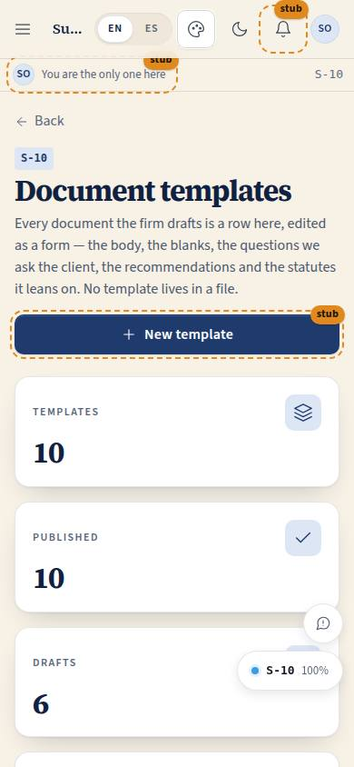
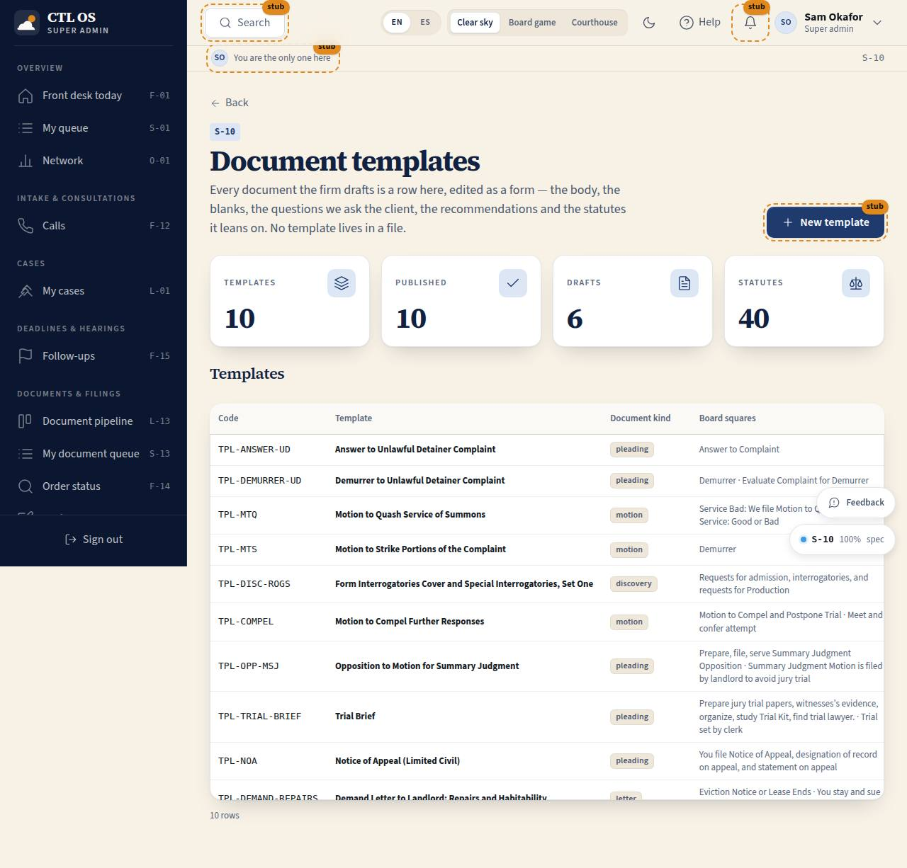

# S-10 · Document templates

## Purpose

Where the firm owns its own paperwork. Every document the firm drafts is a row in `templates`, edited here as forms — the body blocks, the blanks and where each one is filled from, the questions we ask the client, the recommendations checklist and the statutes it leans on — with a live preview on pleading paper and a publish switch that decides whether it is offered when a draft is started. P-07: document templates are first-class and managed in the product, never a loose file and never code.

## Screenshots

| 390 | 1280 |
| --- | --- |
|  |  |

Dark: `../screenshots/S-10/1280-dark.jpg`.

## Sections (layout order)

1. PageHeader — title, lead, "New template" (Placeholder, T-067)
2. StatTiles — templates, published, drafts started from them, statutes cited
3. Templates table — code, title, kind, board squares, version, status, drafts
4. Drawer — the template editor: details, then Body · Blanks · Client questions · Recommendations (with the statute list) · Preview on pleading paper
5. Drawer footer — publish toggle, Close, "Save (version n+1)"

## Data

| Table | Read / write | Notes |
| --- | --- | --- |
| `templates` | read, update | Saving bumps `template_version` |
| `drafts` | read | How many drafts each template has produced |
| `docs/legal/statute-index.md` | read (markdown) | A citation not in the index is flagged, never silently accepted |
| `docs/game-board/nodes.json` | read (build-time) | Board square labels beside the ids |

## Rules

- `RULE-DRAFT-05` — a draft copies the body, so editing a template never rewrites a document already with a client, a supervisor or a court. Only published templates are offered when a draft is started.
- `RULE-DRAFT-02` — statute citations are typed exactly as the index writes them; unmatched ones are shown in red with the reason.

## Actions (manifest)

| Id | Intent | Permission | Params | Live |
| --- | --- | --- | --- | --- |
| `drafting.searchTemplates` | find a template by name, code, board square or statute | `documents.read` | `q: string` | yes |
| `drafting.openTemplate` | open one template to edit it | `documents.read` | `templateId: id` | yes |
| `drafting.closeTemplate` | close the template editor | `documents.read` | — | yes |
| `drafting.editTemplateField` | change one field of the template | `documents.write` | `field: string`, `value: string` | yes |
| `drafting.editTemplateBlock` | change the text or kind of one block | `documents.write` | `blockId: id`, `text: string` | yes |
| `drafting.addTemplateBlock` | add a block to the body | `documents.write` | `type: enum:heading,paragraph,numbered,signature,caption,pagebreak` | yes |
| `drafting.removeTemplateBlock` | remove a block | `documents.write` | `blockId: id` | yes |
| `drafting.moveTemplateBlock` | move a block up or down | `documents.write` | `blockId: id`, `direction: enum:up,down` | yes |
| `drafting.editTemplateVariable` | change one of the blanks | `documents.write` | `key: string`, `field: string`, `value: string` | yes |
| `drafting.addTemplateVariable` | add a blank | `documents.write` | — | yes |
| `drafting.removeTemplateVariable` | remove a blank | `documents.write` | `key: string` | yes |
| `drafting.editTemplateQuestion` | change a client question | `documents.write` | `questionId: id`, `field: string`, `value: string` | yes |
| `drafting.addTemplateQuestion` | add a client question | `documents.write` | — | yes |
| `drafting.removeTemplateQuestion` | remove a client question | `documents.write` | `questionId: id` | yes |
| `drafting.editChecklistItem` | change a recommendation | `documents.write` | `itemId: id`, `field: string`, `value: string` | yes |
| `drafting.addChecklistItem` | add a recommendation | `documents.write` | — | yes |
| `drafting.removeChecklistItem` | remove a recommendation | `documents.write` | `itemId: id` | yes |
| `drafting.editStatuteRefs` | change the statutes this template leans on | `documents.write` | `value: string` | yes |
| `drafting.saveTemplate` | save and bump the version | `documents.write` | — | yes |
| `drafting.togglePublished` | offer it when a draft is started, or take it off | `documents.write` | — | yes |
| `drafting.previewTemplate` | see it on pleading paper with sample values | `documents.read` | — | yes |
| `drafting.newTemplate` | create a new template | `documents.write` | — | stub (T-067) |

## Logic

- The table shows the office's templates and the network library (`tenant_id = ten_network`); search matches code, title, board square and statute citation.
- The editor is forms only: a block is a kind and a text box; a blank is a key, a label, a type and a source; a question is text plus "why we ask"; a recommendation is text plus a rule reference.
- Blocks move with up / down buttons, never drag alone (P-03).
- Saving writes by id and sets `template_version + 1`. The publish toggle writes immediately.
- Preview renders the template on `PleadingPaper` read-only at 75 % with sample values, so the drafter sees the real page before publishing.
- A paralegal reads; writing needs `documents.write` (attorney, owner, super admin), and every control is disabled rather than hidden so the read-only state is legible.

## Components

`PageHeader`, `Section`, `StatTile`, `DataTable`, `Drawer`, `PleadingPaper`, `Tabs`, `Input`, `Textarea`, `Select`, `Toggle`, `Button`, `IconButton`, `Badge`, `StatusBadge`, `Placeholder`, `Tooltip`, `Icon`.

## Placeholders

- **New template** — `Placeholder` with `plannedIn="T-067"`. The ten seeded templates are fully editable; creating one from nothing is the remaining half of T-067.

## Real vs mock

Real: every edit, the version bump, the publish switch, the preview, the statute matching. Mock: the rows are in the localStorage provider.

## Inputs and responsive check (P-01, P-03)

Checked at 360, 390, 768, 1280, 1920, 2560, 3840. The Drawer is full width under 600 px and closes on Escape; the editor tabs scroll horizontally on a phone; every row action is a 44 px `IconButton` with a label. The table falls back to cards under 768.

## Changelog

- `docs/changelog/0022-drafting.md`

## Resumen en español

Aquí el bufete gestiona sus propias plantillas: el cuerpo del documento, los espacios que se rellenan solos, las preguntas que se le hacen al cliente, las recomendaciones y las leyes que cita, todo en formularios y con vista previa en papel de alegatos. Guardar sube la versión; publicar decide si la plantilla se ofrece al empezar un borrador. Editar una plantilla nunca reescribe un documento ya redactado.
