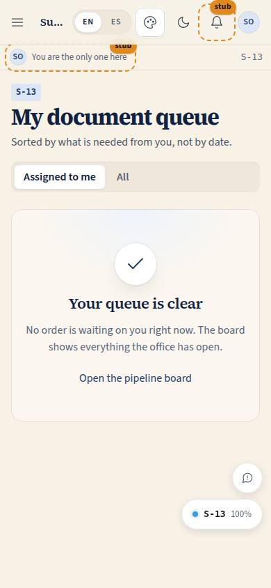
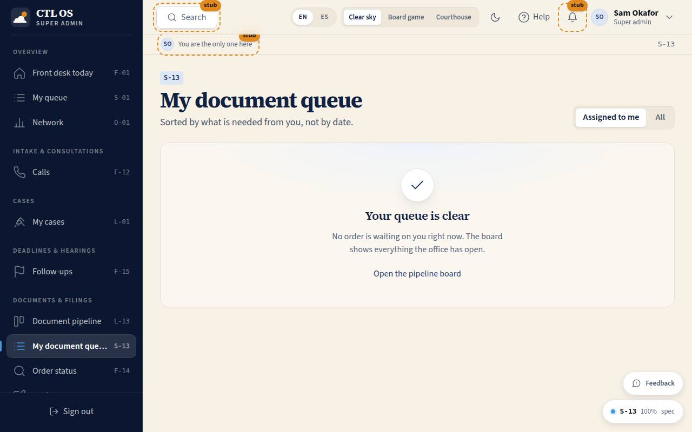

# S-13 · My document queue

## Purpose

The paralegal's working list, grouped by what is actually needed from them right now — details to gather, drafts to prepare, documents to file and serve — with the orders that are only waiting on a client kept separate and read-only.

## Screenshots

| 390 | 1280 |
| --- | --- |
|  |  |

## Sections (layout order)

1. **PageHeader** with the Assigned to me · All switch.
2. **Gather client details** — `assigned`, `gathering_client_details`.
3. **Prepare and assemble** — `details_complete`, `first_draft`, `supervisor_changes`.
4. **File and serve** — `final_signed`, `filed_or_scheduled`, `served`.
5. **Waiting on the client** — read-only, nudge only.

## Data

| Table | Read / write | Notes |
| --- | --- | --- |
| `orders` | read / update | through `applyTransition` only |
| `order_stage_events` | read / insert | the pair written with every move |
| `client_requests` | read | the open count per card |
| `follow_ups` | read / insert | the nudge |
| `users` | read | names |

## Rules

`RULE-PIPE-01`, `RULE-PIPE-02`, `RULE-PIPE-05`, `RULE-PIPE-07`, `RULE-PIPE-08`. A paralegal holds `orders.advance` but not `orders.supervise`, so nothing here can leave supervisor review.

## Actions (manifest)

| Id | Intent | Permission | Params | Live |
| --- | --- | --- | --- | --- |
| `pipeline.setScope` | show only my assignments or everyone's | `orders.read` | `scope: enum:mine,all` | yes |
| `pipeline.openOrder` | open one document order | `orders.read` | `orderId: id` | yes |
| `pipeline.openMoveMenu` | show where this order can move next | `orders.advance` | `orderId: id` | yes |
| `pipeline.moveStage` | move this order on | `orders.advance` | `orderId: id, stage: string` | yes |
| `pipeline.nudgeClient` | ask the front desk to chase this client | `followups.write` | `orderId: id` | yes |
| `pipeline.openDrafting` | start or continue the draft | `drafts.read` | `orderId: id` | yes |

## Logic

- Each card carries the one move that usually comes next as a single primary button (details complete, attorney review, filed, served, proof of service), plus Move to for everything else.
- The waiting section is read-only by design: that work belongs to the client, and the only useful action is the nudge that creates the desk's follow-up.
- Oldest wait first inside every section.
- "Assigned to me" is `assigned_paralegal_id` or `assigned_attorney_id` = me; the All switch is for covering someone.

## Components

PageHeader, Section, SegmentedControl, Button, EmptyState, **OrderCard**, **WaitingOnPill**, DocPreview, Icon.

## Placeholders

None on this page; the drafting link is a real route owned by the drafting worker.

## Real vs mock

Real throughout.

## Inputs and responsive check (P-01, P-03)

Checked at 360, 390, 768, 1280, 1920, 2560, 3840. The card grid reflows from one column on a phone to wide cards at 2560. Every card is one tab stop with Enter and "M"; the quick move is a real button.

## Changelog

- `docs/changelog/0020-pipeline.md`

## Resumen en español

La cola del asistente, agrupada por lo que se necesita de él: recopilar datos, preparar borradores, presentar y notificar; y aparte, solo lectura, lo que espera al cliente. Cada fila trae el movimiento siguiente como un botón.

## Note on the menu label

The assistants' home (S-01) already uses "My queue" in the Overview group, so this page is listed as **My document queue** in Documents & filings and its heading matches. The route and the code are unchanged.
