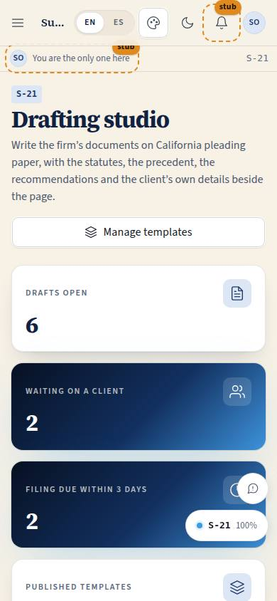
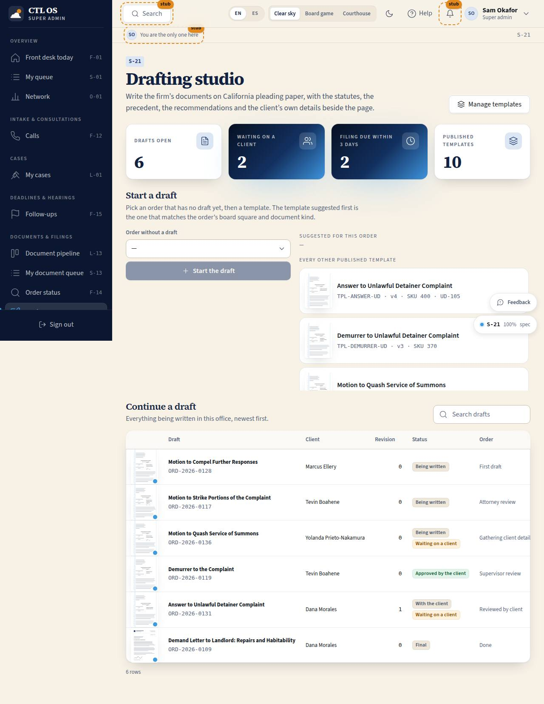

# S-21 · Drafting studio

## Purpose

A paralegal or attorney opens this page to write something. It does two things and nothing else: start a draft for an order that does not have one (with the right template offered first), or pick up something already being written. Every draft in the office is in one table with its order, client, revision, status, pipeline stage, filing deadline and a picture of the page itself, so the person who has to write four documents today can see which one is late and which one the client is sitting on.

## Screenshots

| 390 | 1280 |
| --- | --- |
|  |  |

Dark: `../screenshots/S-21/390-dark.jpg`, `../screenshots/S-21/1280-dark.jpg`. TV: `../screenshots/S-21/3840.jpg`.

## Sections (layout order)

1. PageHeader — title, lead, "Manage templates" (S-10)
2. StatTiles — drafts open, waiting on a client, filing due within 3 days, published templates
3. Start a draft — order picker (only orders without a draft), suggested templates then every other published one, "Start the draft"
4. Continue a draft — DataTable of every draft with a `DocPreview` at `xs`
5. Source note

## Data

| Table | Read / write | Notes |
| --- | --- | --- |
| `drafts` | read, insert | Starting a draft inserts the row and navigates to S-22 |
| `templates` | read | Only `status = published` is offered |
| `orders` | read, update | `template_id` is stamped on the order when a draft starts |
| `users` | read | Client and attorney names |
| `cases` | read | County and court for the caption |
| `client_requests`, `draft_questions` | read | The "waiting on a client" count |

## Rules

- `RULE-DRAFT-05` — a draft copies the template body; a later template edit never rewrites a document already drafted. Only published templates are offered.
- `RULE-DRAFT-01` — nothing here can make a document final; the studio decides that (S-22).
- `RULE-PIPE-01`, `RULE-PIPE-02` — the stage and the waiting-on chip come from the pipeline domain, never from a column typed by hand.

## Actions (manifest)

| Id | Intent | Permission | Params | Live |
| --- | --- | --- | --- | --- |
| `drafting.search` | find a draft by document, order or client | `drafts.read` | `q: string` | yes |
| `drafting.pickOrder` | choose which order to draft for | `drafts.write` | `orderId: id` | yes |
| `drafting.pickTemplate` | choose which template to draft from | `drafts.write` | `templateId: id` | yes |
| `drafting.startDraft` | start a draft for this order from this template | `drafts.write` | `orderId: id`, `templateId: id` | yes |
| `drafting.openDraft` | open a draft in the studio | `drafts.read` | `draftId: id` | yes |
| `drafting.openTemplates` | open the template manager | `documents.write` | — | yes |

## Logic

- Orders offered are the open orders of the current office with no `drafts` row; `?order=<id>` preselects one (the pipeline module links in this way).
- `suggestTemplates()` puts templates whose `board_node_ids` contain the order's `board_node_id`, or whose `document_kind` matches, under "Suggested for this order"; everything else published follows.
- Starting a draft copies `templates.body_blocks` into `drafts.blocks`, resolves what the case, client and order rows already know into `drafts.variables`, and builds the caption from the office attorney block.
- "Waiting on a client" counts drafts whose order is `isWaitingOnClient`; "filing due within 3 days" reads `orders.filing_due_at`.
- Deleting a draft is deliberately absent: revisions supersede, nothing is removed.

## Components

`PageHeader`, `Section`, `StatTile`, `DataTable`, `DocPreview`, `Select`, `SearchInput`, `Button`, `Badge`, `StatusBadge`, `Chip`, `Tooltip`, `EmptyState`, `Icon`.

## Placeholders

None on this page.

## Real vs mock

Real: the whole flow (insert a draft, stamp the order, navigate). Mock: the rows live in the localStorage provider; when Supabase lands nothing on the page changes, only `DataContext`'s provider.

## Inputs and responsive check (P-01, P-03)

Checked at 360, 390, 768, 1280, 1920, 2560, 3840. The template picker is a `radiogroup` of 44 px rows operable with Enter and Space (it is a `div role="radio"`, not a `button`, because a button collapses around the `DocPreview`). The table falls back to cards under 768. Nothing is hover-only.

## Changelog

- `docs/changelog/0022-drafting.md`

## Resumen en español

Aquí empieza o se retoma la redacción de un documento: elige un pedido sin borrador y la plantilla que corresponde a su casilla del tablero, o abre uno de los borradores de la oficina. La tabla muestra el pedido, el cliente, la revisión, el estado, la etapa y si la presentación vence en tres días o menos.
