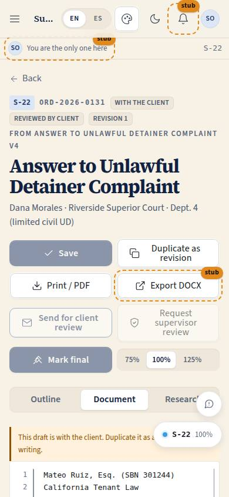
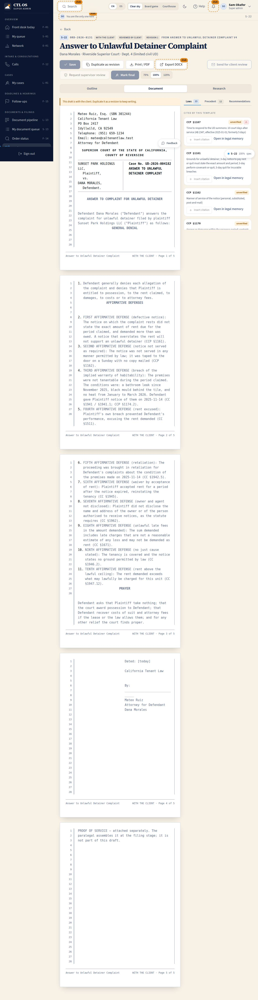

# S-22 · Drafting studio: the draft

## Purpose

This is the page Justin asked for: "a really cool system for drafting documents with relevant laws automatically on the side, precedence, recommendations, access to client details, etc. The pleading paper drafting system needs lots of attention, things to ask client, with ability to send the client the questions or requests for items." California pleading paper sits in the middle with 28 numbered lines and a real caption; the outline and the blanks are on the left; the statutes, the precedent, the live recommendations, the client's own details and the questions we still owe them are on the right — and one button turns those questions into requests the client answers in their app.

> Code note: the studio index is S-21 and this detail page is **S-22**. The prompt called it "S-21 detail"; a page code per route is the rule (`CLAUDE.md`, page docs are one per code), and S-22 was free in the S range (S-10 templates, S-11 assembly, S-12 multi-editor, S-13 paralegal queue, S-20 e-sign are reserved in `build-plan.md`).

## Screenshots

| 390 | 1280 |
| --- | --- |
|  |  |

Dark: `../screenshots/S-22/390-dark.jpg`, `../screenshots/S-22/1280-dark.jpg`. TV: `../screenshots/S-22/3840.jpg`.

## Sections (layout order)

1. PageHeader — order ref, draft status, pipeline stage, revision, template and version, client and court
2. Toolbar — Save · Duplicate as revision · Print / PDF · Export DOCX (Placeholder) · Send for client review · Request supervisor review · Mark final · zoom 75 / 100 / 125
3. Pane switch (under 1600 px) — Outline · Document · Research
4. Left — outline of blocks, blanks to fill
5. Centre — the `PleadingPaper` editor
6. Right — Laws · Precedent · Recommendations · Client · Questions, then the template's unused questions

## Data

| Table | Read / write | Notes |
| --- | --- | --- |
| `drafts` | read, update, insert | Save, duplicate as revision, status changes |
| `templates` | read | Body, blanks, questions, checklist, statutes |
| `precedents` | read | Matched by board square and statute |
| `draft_questions` | read, insert, update | Picked, added, sent, answered |
| `orders` | read, update | `applyTransition()` patch |
| `order_stage_events` | insert | Every move is an append-only event |
| `client_requests` | read, insert | What the client actually sees |
| `cases`, `users`, `documents` | read | Client tab: parties, court, language, binder count |
| `docs/legal/statute-index.md` | read (markdown) | Parsed with `parseStatutes()`; never copied into a table |

## Rules

- `RULE-DRAFT-01` — "Mark final" needs `orders.supervise` and only appears while the order is in `supervisor_review`; the drafter gets "Request supervisor review" instead. The draft status prints in the page footer so an unreviewed copy is recognisable.
- `RULE-DRAFT-02` — only citations that exist in the statute index can be inserted; unverified rows carry the badge in the panel and an open item in the recommendations.
- `RULE-DRAFT-03` — sending questions writes `client_requests` rows and stamps `draft_questions.request_id`; if the order is in `assigned` or `details_complete` it also moves to `gathering_client_details`.
- `RULE-DRAFT-04` — every precedent is unverified; the badge is on the card and on the insert toast.
- `RULE-DRAFT-05` — the draft is a copy of the template, not a link.
- `RULE-PIPE-01`, `RULE-PIPE-04`, `RULE-PIPE-07`, `RULE-PIPE-08` — moves go through `applyTransition()`; a refused move is reported and never written.

## Actions (manifest)

| Id | Intent | Permission | Params | Live |
| --- | --- | --- | --- | --- |
| `drafting.save` | save this draft | `drafts.write` | — | yes |
| `drafting.editBlock` | change the text of one block | `drafts.write` | `blockId: id`, `text: string` | yes |
| `drafting.setVariable` | fill one of the blanks | `drafts.write` | `key: string`, `value: string` | yes |
| `drafting.duplicateRevision` | start the next revision | `drafts.write` | — | yes |
| `drafting.print` | print on pleading paper or save as PDF | `drafts.read` | — | yes |
| `drafting.exportDocx` | download as a Word document | `drafts.read` | — | stub (T-069 / T-097) |
| `drafting.sendForClientReview` | send this draft to the client | `orders.advance` | `message: string` | yes |
| `drafting.requestSupervisorReview` | send to the supervising attorney | `orders.advance` | — | yes |
| `drafting.markFinal` | sign off as the final version | `orders.supervise` | — | yes |
| `drafting.setZoom` | make the page bigger or smaller | `drafts.read` | `zoom: enum:75,100,125` | yes |
| `drafting.setPanelTab` | show laws / precedent / recommendations / client / questions | `drafts.read` | `tab: enum:...` | yes |
| `drafting.focusBlock` | move the caret to one block | `drafts.read` | `blockId: id` | yes |
| `drafting.searchLaws` | search the statutes for something to cite | `docs.read` | `q: string` | yes |
| `drafting.insertCitation` | insert a statute citation | `drafts.write` | `citation: string` | yes |
| `drafting.insertPrecedent` | insert a case citation | `drafts.write` | `precedentId: id` | yes |
| `drafting.openStatute` | open the statute in the legal memory | `docs.read` | `citation: string` | yes |
| `drafting.toggleChecklistItem` | tick off a recommendation | `drafts.write` | `itemId: id` | yes |
| `drafting.toggleQuestion` | select a question for the client | `drafts.write` | `questionId: id` | yes |
| `drafting.addQuestion` | add your own question or item request | `drafts.write` | `text: string`, `kind: enum:question,item` | yes |
| `drafting.sendQuestions` | send the selected questions to the client | `orders.write` | — | yes |
| `drafting.insertAnswer` | insert the client's answer | `drafts.write` | `questionId: id` | yes |
| `drafting.openOrder` | open the order this draft belongs to | `orders.read` | — | yes |

## Logic

- **The page.** `PleadingPaper` renders blocks with `{{variables}}` resolved, each block a `contentEditable` region snapped to the 28-line grid. Pagination is computed by line count (28 lines a page, ~85 characters a line), so the editor, the print stylesheet and a screenshot break in the same places. An unresolved blank prints as `[blank name]`, never as nothing.
- **Writes.** Edits are local until Save, which writes `blocks`, `variables` and a recomputed `word_count` by id through the provider. Variable edits, checklist ticks, questions and stage moves write immediately. Nothing is stored only in memory that another editor would lose (P-14).
- **Recommendations.** `liveRecommendations()` computes: unresolved required blanks, caption gaps, a filing deadline within three days (or passed), unverified statutes and how many carry a ⚠ currency flag, unverified precedents, questions picked but not sent, requests still open with the client, whether the client has approved, whether supervisor review is pending, and the word count. The template's own checklist renders beneath, each item with its statute reference; ticks persist in `drafts.variables._checklist`.
- **Questions → the client.** Each selected `draft_questions` row becomes a `client_requests` row (`kind` question or item, `prompt` the question, `detail` the "why we ask", `sent_via: app`, due in three days) and is stamped `sent`. An answered request shows the answer with "Insert answer".
- **Stage moves.** Send for client review is offered from `first_draft` or `attorney_review` only; it writes the review request, moves the order to `client_review` and sets the draft to `sent_for_client_review`. Request supervisor review moves `approved_by_client → supervisor_review`. Mark final moves `supervisor_review → final_signed`.
- **Addressable state.** `?zoom=`, `?tab=` and `?pane=` are in the URL, so a voice controller or a screenshot script can put the page in any state (P-06).

## Components

`PageHeader`, `PleadingPaper`, `Tabs`, `SegmentedControl`, `Card`, `Section`, `Modal`, `Input`, `Textarea`, `Select`, `Checkbox`, `Button`, `IconButton`, `Badge`, `StatusBadge`, `Placeholder`, `Tooltip`, `EmptyState`, `SearchInput`, `Icon`. The five-tab research panel is module chrome (`SidePanel.tsx`), like `catalogChrome.tsx`.

## Placeholders

- **Export DOCX** — `Placeholder` with `plannedIn="T-069 / T-097"`. Print and PDF are real (the browser's print dialogue over the print stylesheet).

## Real vs mock

Real: the editor, the line grid, pagination, print and PDF, every write, every stage move, the statute index (parsed from the repo markdown at build time), the client requests. Mock: the rows are in the localStorage provider; DOCX export does not exist yet; there is no collaborative editing (S-12 / T-097), though every write already goes by id with a `version` so nothing here has to be undone for it.

## Inputs and responsive check (P-01, P-03)

Checked at 360, 390, 768, 1280, 1920, 2560, 3840.

- Three panes at ≥ 1600. From 1024 to 1599 the sheet keeps the width with the research panel beside it and the outline is one tab away; under 1024 one pane at a time. The pane switch is a `SegmentedControl`, so it is keyboard- and d-pad-friendly, never a gesture.
- In the editor: Tab / Shift+Tab move between blocks, Escape leaves a block, Ctrl/Cmd+B / I / U format. The block toolbar appears on focus, not on hover.
- Every button is ≥ 44 px; a disabled stage button keeps a tooltip saying why ("Not allowed from this stage").
- At ≥ 2560 the sheet and both panes grow with `--scale` instead of leaving the width as whitespace; the page stays legible from across a room.
- Print: only the pleading pages print (everything else is hidden by visibility, so the sheet keeps its own layout), at Letter with 28 lines and a footer on every page.

## Changelog

- `docs/changelog/_pending/drafting.md`

## Resumen en español

El taller de redacción: el papel de alegatos (pleading paper) de California en el centro con sus 28 líneas numeradas y el encabezado (caption) de la primera página; a la izquierda el esquema y los espacios por completar; a la derecha las leyes del índice de estatutos, los precedentes, las recomendaciones calculadas en vivo, los datos del cliente y las preguntas que aún le debemos. "Enviar al cliente" convierte esas preguntas en solicitudes que el cliente ve en su aplicación y, si corresponde, mueve el pedido a "recopilando datos del cliente". Solo un abogado supervisor puede marcar el documento como final. Todas las leyes y precedentes se muestran como "sin verificar" hasta que un abogado los confirme.
