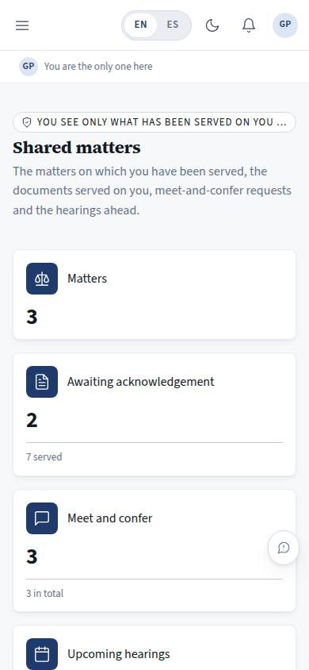
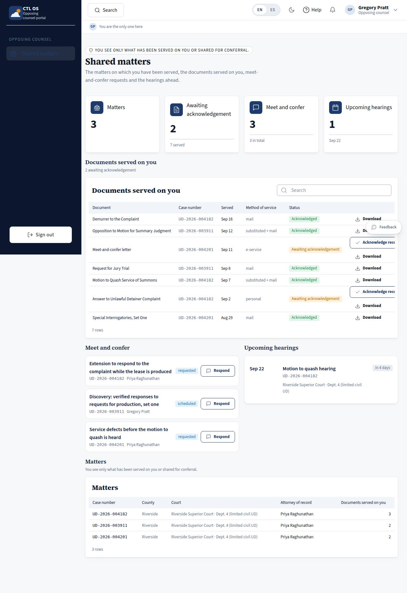

# X-01 · Opposing counsel portal

## Purpose

The landlord-side attorney sees exactly what has been shared with them and nothing else: the matters on which they are a served party, the documents served on them (which they can acknowledge), the meet-and-confer requests open between the parties, and the hearings ahead. Professional and minimal by design — this is the one surface where an adversary is the user.

## Screenshots

| 390 | 1280 |
| --- | --- |
|  |  |

## Sections (layout order)

1. PageHeader — a scope note: "You see only what has been served on you or shared for conferral."
2. StatTiles — matters, awaiting acknowledgement, conferrals, upcoming hearings.
3. ServedDocuments — DataTable: document, case number, served date, method of service, acknowledged state; "Acknowledge receipt" and "Download".
4. MeetAndConfer — topic, case number, who asked, status, "Respond".
5. UpcomingHearings — a dated timeline with the court.
6. Matters — case number, county, court, attorney of record, count of documents served.

## Data

| Table | Read / write | Notes |
| --- | --- | --- |
| `service_events` | read / write | `served_to_user_id = me`; `acknowledged_at` written by id |
| `meet_confer` | read | `opposing_user_id = me` |
| `cases` | read | only the matters reached through the two tables above |
| `documents` | read | titles of the served documents only |
| `deadlines` | read | hearings on the shared matters |
| `users` | read | the attorney of record's name |

## Rules

- `RULE-UD-02` — the trial setting both sides work to.
- `RULE-SYS-02` — the acknowledgement is one write by id, and it is idempotent.

## Actions (manifest)

| Id | Intent | Permission | Params | Live |
| --- | --- | --- | --- | --- |
| `opposition.acknowledgeService` | acknowledge receipt of a document served on me | `opposition.read` | `id: id` | yes |
| `opposition.respondMeetConfer` | respond to a meet-and-confer request | `messages.write` | `id: id` | stub |
| `opposition.downloadDocument` | download a document served on me | `documents.read_own` | `id: id` | stub |

## Logic

- **Scope is derived, never chosen.** A matter appears only when a `service_events` row names me as `served_to_user_id` or a `meet_confer` row names me as `opposing_user_id`. With neither, the page is a single EmptyState.
- Nothing internal is rendered: no assignments, invoices, paralegals, internal notes, lesson progress or board strategy. Only the case number, county, court and attorney of record.
- Acknowledging writes `acknowledged_at = now`; a second run reports "already acknowledged" instead of overwriting.
- Hearings are pending deadlines on the shared matters naming a hearing, trial or conference — the calendar both sides share.

## Components

PageHeader, StatTile, Section, Card, DataTable, Badge, StatusBadge, Chip, Button, EmptyState, Placeholder.

## Placeholders

Respond to a conferral → Pass 2 comms (T-080). Download → document storage.

## Real vs mock

Real: the derived scope, the acknowledgement write, the counts. Mock: the rows. When Supabase lands, the two RLS intents on `service_events` and `meet_confer` become the policies that enforce what this page already assumes.

## Inputs and responsive check (P-01, P-03)

Checked at 360–3840, light and dark. Tables become cards under 768 px with the service method hidden on the card; the acknowledged / awaiting state is a badge with text, never colour alone; the two middle sections form a two / three column band on wide screens.

## Changelog

- `docs/changelog/_pending/homes.md`

## Resumen en español

El portal del abogado contrario: solo los asuntos en los que se le notificó, los documentos notificados (que puede acusar de recibidos), las solicitudes de conciliación y las audiencias próximas. Nada interno del bufete.
